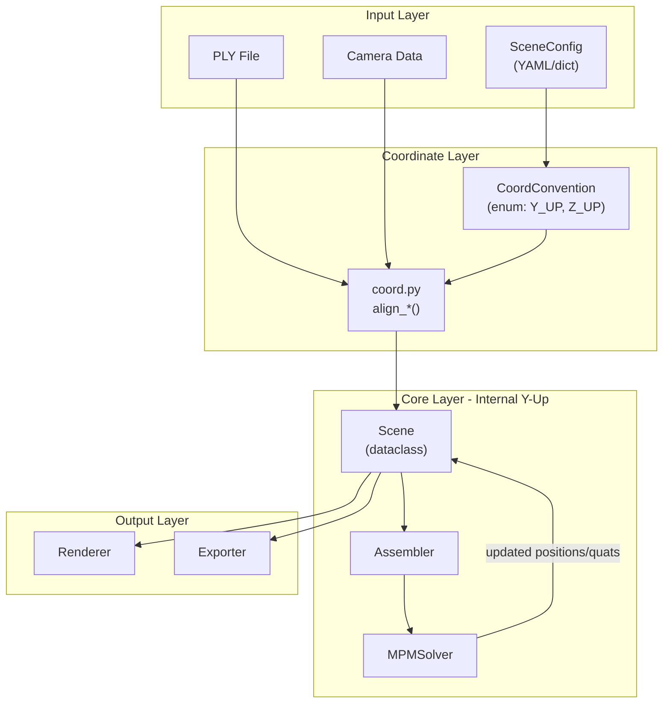

# 全面重构：坐标系显式管理 + 旋转工具统一 + Pipeline 架构整理

> 由对话中确认的方案整理（方案 C：坐标系 + 旋转收敛 + Pipeline 整理）。

## 一、现状诊断摘要

**坐标系问题**：MPM solver 中 gravity 硬编码为固定向量，不同来源 3DGS 数据的 world-up 可能是 Y-up 或 Z-up，仓库无法处理差异。全链路无任何显式坐标系声明。

**代码散乱**：四元数/旋转逻辑散落在 `assembler.py`、`scene_setup.py`、`mpm_solver_taichi.py`、`bench_auto_iggt.py` 等多处，存在重复和不一致（wxyz vs xyzw）。Pipeline 是面条代码，无清晰分层。

**内部统一约定选择：Y-up 右手系**。理由：3DGS 渲染器 `getProjectionMatrix` 使用 OpenGL NDC（Y-up），Taichi 示例普遍 Y-up。选 Y-up 最小化内部转换次数。

---

## 二、新增 `physics_sim/coord.py` — 坐标系核心模块

单文件，约 80 行，包含：

- `enum UpAxis { Y_UP, Z_UP }` — 枚举声明
- `alignment_matrix(source: UpAxis, target: UpAxis) -> np.ndarray 3x3` — 返回旋转矩阵（Z-up→Y-up 即绕 X 轴旋转 -90°；同类型返回 identity）
- `align_positions(pos, src, tgt)` — 点云坐标转换
- `align_rotations_quat(quats_wxyz, src, tgt)` — 四元数批量转换
- `align_gravity(up: UpAxis) -> np.ndarray` — 返回内部约定下的 gravity 向量（始终 `[0, -9.8, 0]`，因为内部是 Y-up）
- `align_camera_extrinsics(R, T, src, tgt)` — 相机外参转换

这是唯一允许出现坐标轴变换逻辑的地方。

---

## 三、新增 `physics_sim/rotation_utils.py` — 旋转工具统一模块

单文件，约 100 行，收敛所有散落的旋转代码：

- `quat_multiply(q1, q2)` — wxyz 约定，支持 numpy batch
- `quat_to_rotation_matrix(q_wxyz)` — wxyz → 3×3
- `rotation_matrix_to_quat(R)` — 3×3 → wxyz
- `quat_apply(q_wxyz, v)` — 用四元数旋转向量
- `quat_from_axis_angle(axis, angle)` — 轴角 → 四元数

文件头部注释明确声明：**本仓库所有四元数均使用 wxyz 顺序**。

删除 `assembler.py`、各 stage 中的重复旋转函数，改为 `from physics_sim.rotation_utils import ...`。

---

## 四、新增 `physics_sim/scene_data.py` — 场景数据结构

定义清晰的 dataclass 替代散落的 dict/tuple 传递：

```python
@dataclass
class SceneConfig:
    ply_path: str
    camera_path: str | None
    source_up: UpAxis          # 用户声明的源数据 up 方向
    gravity_magnitude: float = 9.8
    material: str = "jelly"
    # ... 其他物理/实验参数

@dataclass
class SceneData:
    """内部数据，始终 Y-up 右手系"""
    positions: np.ndarray      # (N,3)
    rotations_wxyz: np.ndarray # (N,4) wxyz
    scales: np.ndarray         # (N,3)
    sh_coeffs: np.ndarray
    opacities: np.ndarray
    cameras: list              # Camera objects
    config: SceneConfig
```

---

## 五、重构 `physics_sim/stages/scene_setup.py`

将当前面条代码拆分为职责清晰的函数：

1. `load_ply(path) -> dict` — 纯 PLY 读取，无坐标变换
2. `load_cameras(path) -> list[Camera]` — 相机加载
3. `build_scene(config: SceneConfig) -> SceneData` — 组合上述两步 + 调用 `coord.align_positions` / `align_rotations_quat` 做一次性坐标对齐

坐标变换**只在 `build_scene` 中发生一次**，之后 `SceneData` 内部始终是 Y-up。

---

## 六、重构 `physics_sim/assembler.py`

- 坐标变换逻辑 → 删除，已由 `coord.py` 在入口处理
- 四元数工具函数 → 删除，已迁移到 `rotation_utils.py`
- 保留核心职责：`assemble(scene: SceneData) -> TaichiFields` — 从 `SceneData` 填充 Taichi fields

---

## 七、重构 `physics_sim/mpm_solver_taichi.py`

- gravity 不再硬编码，改为 `__init__` 参数 `gravity: ti.Vector`
- 由外部通过 `coord.align_gravity(config.source_up)` 传入（内部 Y-up 下始终为 `[0, -9.8, 0]`）
- 提取 Taichi kernel 中的内联四元数运算为 `@ti.func`，集中在文件顶部，并加注释对应 `rotation_utils` 中的 numpy 版本

---

## 八、重构 `physics_sim/stages/rendering.py` 和 `simulation.py`

- `simulation.py`：接收 `SceneData` + `TaichiFields`，调用 `solver.step()`，更新 `SceneData`
- `rendering.py`：接收 `SceneData`（Y-up），直接传给 gaussian-splatting 渲染器（其 OpenGL 管线也是 Y-up，无需转换）
- 如需导出为其他坐标系，在此处调用 `coord.align_positions(data, Y_UP, original_up)` 做逆变换

---

## 九、重构 `experiments/bench_auto_iggt.py` — 实验入口

简化为：

```python
config = SceneConfig(
    ply_path="...",
    source_up=UpAxis.Z_UP,  # 用户唯一需要指定的坐标系信息
    material="jelly",
    # ...
)
scene = build_scene(config)
fields = assemble(scene)
run_simulation(scene, fields)
render_output(scene)
```

---

## 十、文件变更清单

| 操作 | 文件 | 说明 |
|------|------|------|
| 新增 | `physics_sim/coord.py` | 坐标系枚举 + 转换（约 80 行） |
| 新增 | `physics_sim/rotation_utils.py` | 统一旋转工具（约 100 行） |
| 新增 | `physics_sim/scene_data.py` | `SceneConfig` + `SceneData` dataclass（约 60 行） |
| 重构 | `physics_sim/stages/scene_setup.py` | 拆分为 load_ply + load_cameras + build_scene |
| 重构 | `physics_sim/assembler.py` | 删除坐标变换和旋转工具，只保留 Taichi field 填充 |
| 重构 | `physics_sim/mpm_solver_taichi.py` | gravity 参数化，四元数 `@ti.func` 集中 |
| 重构 | `physics_sim/stages/simulation.py` | 接收 `SceneData`，调用 solver |
| 重构 | `physics_sim/stages/rendering.py` | 接收 `SceneData`，直传渲染器 |
| 重构 | `experiments/bench_auto_iggt.py` | 简化为 config → build → sim → render |
| 不动 | `gaussian-splatting/` | 子模块不修改 |

---

## 十一、执行顺序

1. **先新增 3 个基础模块**（`coord.py`, `rotation_utils.py`, `scene_data.py`）— 无破坏性
2. **重构 `scene_setup.py`** — 使用新模块，验证 PLY 加载 + 坐标对齐正确
3. **重构 `assembler.py`** — 删除冗余，改用 `SceneData` 输入
4. **重构 `mpm_solver_taichi.py`** — gravity 参数化
5. **重构 `simulation.py` + `rendering.py`** — 适配新数据流
6. **重构 `experiments/bench_auto_iggt.py`** — 简化入口
7. **端到端测试** — 用已有场景验证渲染结果和物理模拟方向一致

---

## 十二、架构示意（分层）



**原则**：入口转换，内部统一，出口按需还原。

---

## 备注

- 物理模拟在内部统一为 **Y-up**；若源数据为 **Z-up**，在入口做一次对齐即可。
- 相机：子模块一般为 COLMAP/OpenCV 风格（x 右、y 下、z 前）；与「世界 up」相关的错误主要来自 PLY 与内部 world-up 不一致，需在配置中显式声明 `source_up` 并在 `coord` 层统一处理。
