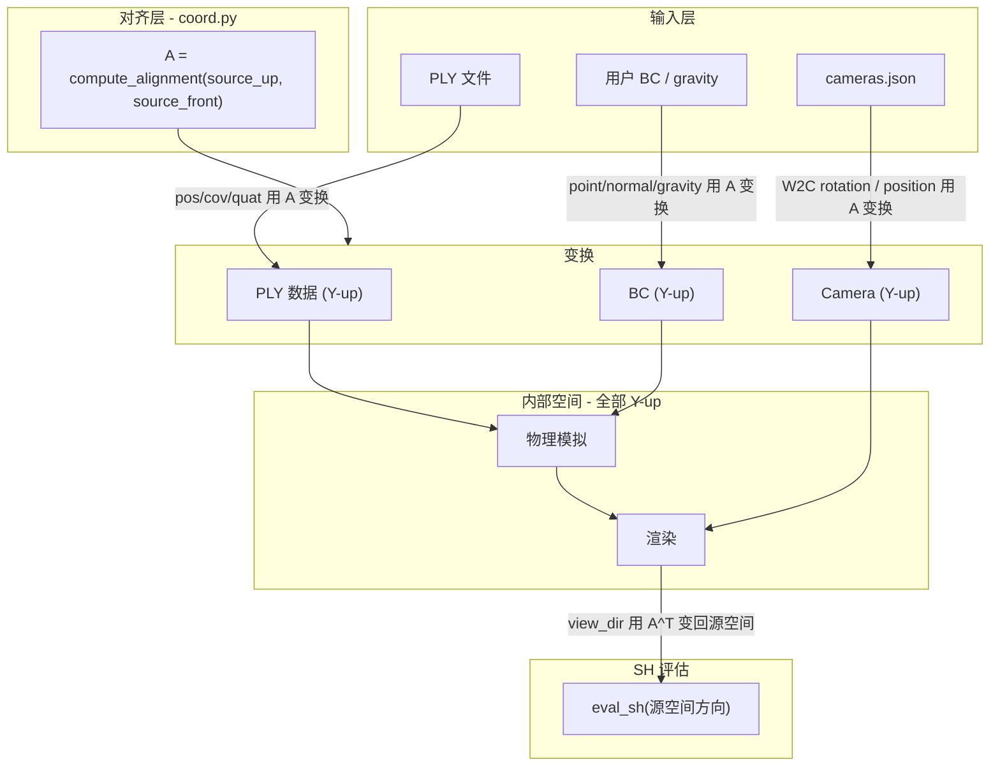

# 坐标系处理方案 V2：完整双轴约定

## 问题诊断

当前方案有以下根本缺陷：

### 1. 只有 up-axis，不足以确定完整对齐

当前 `UpAxis` 只有 `Y_UP / Z_UP`，但一个 3D 旋转有 3 个自由度，仅指定 up-axis 只约束了 1 个自由度（绕 up-axis 的旋转未确定）。`_z_up_to_y_up_matrix` 硬编码了 `x->x, y->-z, z->y`，**隐式假定了源数据的 front 方向是 -Y**（Blender 约定）。对于 COLMAP 输出，水平方向完全由 SfM 收敛结果决定，这个假设经常不成立。

### 2. orbit 相机方向完全随机

[camera_setup.py](physics_sim/stages/camera_setup.py) 中 `generate_local_coord([0,1,0])` 使用种子向量 `[1,1,1]` 做 Gram-Schmidt，产生的 `h1 = [1,0,1]/sqrt(2)`，azimuth=0 方向是 XZ 平面的 45 度角——**完全无语义**。用户必须盲猜 `init_azimuth`。

### 3. gravity 配置与 source_up 不一致

[bench_auto_iggt.py](experiments/bench_auto_iggt.py) 中 `source_up="Y_UP"` 但 `g=[0,0,-9.8]`。若场景真是 Y-up，gravity 应该是 `[0,-9.8,0]`。实际上 `g` 向量暗示数据是 Z-up，但 `source_up` 错标了。整个"用户在 material 里写 gravity 向量"的设计是 bug 温床。

### 4. cameras.json 相机约定未文档化

`build_camera_from_json` 假设 `rotation + position` 组成 W2C 矩阵（COLMAP/3DGS 风格），但从未显式声明。对于非 COLMAP 来源，用户无从得知格式要求。

---

## 设计方案

### 核心变更：`UpAxis` -> `SourceAxes`（双轴约定）

用户配置两个轴即可唯一确定 3x3 对齐矩阵：

```python
class PreprocessConfig(BaseModel):
    source_up: str = "+Y"       # 源数据中哪个轴朝上
    source_front: str = "+Z"    # 源数据中哪个轴朝向观察者（即相机默认视角方向）
    # 第三个轴（right）由 cross(up, front) 导出，保证右手系
    # 如果用户的源数据是左手系，翻转 front 的符号即可校正
```

内部约定不变：**X-right, Y-up, Z-toward-viewer（OpenGL 风格右手系）**。

从 `(source_up, source_front)` 到对齐矩阵 A 的推导：

```python
def compute_alignment(up_str: str, front_str: str) -> torch.Tensor:
    up_src = parse_axis(up_str)       # e.g. "+Z" -> [0,0,1]
    front_src = parse_axis(front_str) # e.g. "-Y" -> [0,-1,0]
    right_src = cross(up_src, front_src)  # 右手系导出
    # 对齐矩阵：将 (right_src, up_src, front_src) 映射到 ([1,0,0], [0,1,0], [0,0,1])
    B_src = column_stack(right_src, up_src, front_src)  # 3x3
    A = B_src.T  # 因为 B_internal = I，所以 A = B_src^{-1} = B_src^T（正交阵）
    return A
```

### 常用预设

在 `coord.py` 中提供命名预设，方便用户使用：

```python
PRESETS = {
    "OPENGL":   dict(up="+Y", front="+Z"),    # 内部约定，identity
    "BLENDER":  dict(up="+Z", front="-Y"),     # Blender 默认世界坐标
    "Z_UP_X_FRONT": dict(up="+Z", front="+X"),# 某些 COLMAP 场景
    "Z_UP_Y_FRONT": dict(up="+Z", front="+Y"),# 另一种 COLMAP 场景
}
```

用户也可以直接写 `source_up="+Z", source_front="-Y"` 而不使用预设。

### 数据流（完整链路）



### 具体文件变更

#### 1. [physics_sim/coord.py](physics_sim/coord.py)

- 保留 `UpAxis` 作为向后兼容别名，核心替换为：
  - `parse_axis(s: str) -> ndarray`: 解析 "+X", "-Z" 等为单位向量
  - `compute_alignment(up: str, front: str) -> Tensor`: 从双轴计算 3x3 对齐矩阵
  - `SourceAxes` dataclass: 存储 `(up, front, alignment_matrix, alignment_inv)`
  - `SourceAxes.from_config(source_up, source_front)`: 工厂方法
- 所有 `align_positions`, `align_covariances` 等函数改为接受 `SourceAxes` 或 `Tensor`（3x3 矩阵），不再接受 `UpAxis` 枚举
- 相机函数 `align_camera_w2c_rotation` / `align_camera_position` 同样改为接受 3x3 矩阵

#### 2. [physics_sim/config/models.py](physics_sim/config/models.py)

```python
class PreprocessConfig(BaseModel):
    opacity_threshold: float = 0.02
    source_up: str = "+Y"
    source_front: str = "+Z"    # 新增
    scale: float = 1.0
    # 移除 deprecated axis_permutation / rotation_degree / rotation_axis
```

#### 3. Gravity 处理重构

**删除** material 中的 `g` 向量配置。gravity 由 `source_up` 唯一确定：

```python
# 在 backend_init.py 中
g_magnitude = material.get("g_magnitude", 9.8)  # 只配置大小
g_internal = [0.0, -g_magnitude, 0.0]  # 内部 Y-up，gravity 恒为 -Y
```

用户配置简化为：

```python
material=dict(
    density=981.8,
    g_magnitude=9.8,  # 只需要大小，方向由坐标系自动决定
    ...
),
```

#### 4. [physics_sim/stages/camera_setup.py](physics_sim/stages/camera_setup.py)

修复 `observant_coordinates` 的构建——使用确定性的、语义明确的基底：

```python
# 内部 Y-up 空间下的标准 orbit 基底
h1 = np.array([0.0, 0.0, 1.0])   # azimuth=0 -> 相机在 +Z（正对场景正面）
h2 = np.array([-1.0, 0.0, 0.0])  # azimuth=90 -> 相机在 -X（场景左侧）
vertical = np.array([0.0, 1.0, 0.0])  # Y-up
observant_coordinates = np.column_stack((h1, h2, vertical))
```

这样 `azimuth=0` 就是"正面"，语义清晰。如果 `source_front` 正确配置了源数据的朝向，对齐后场景的正面在 +Z，camera 在 +Z 处看向原点 = 正面视角。

#### 5. [physics_sim/scene/assembler.py](physics_sim/scene/assembler.py)

- 将 `UpAxis.from_string(pp.source_up)` 改为 `SourceAxes.from_config(pp.source_up, pp.source_front)`
- 所有 `align_*` 函数传入 `SourceAxes` 对象或其 `alignment_matrix`

#### 6. [physics_sim/stages/scene_setup.py](physics_sim/stages/scene_setup.py)

- `SceneData` 中 `source_up: UpAxis` 改为 `source_axes: SourceAxes`
- `alignment_inv` 从 `source_axes.alignment_inv` 获取

#### 7. [physics_sim/stages/backend_init.py](physics_sim/stages/backend_init.py)

- 所有 `align_positions(x, source_up)` 改为 `align_positions(x, source_axes)`
- gravity 不再从 material 的 `g` 向量读取，改为用 `g_magnitude` + 内部方向
- `prefer_up` 默认值改为从 `source_axes.up_vector` 获取（而非硬编码 `[0,0,1]`）

#### 8. [physics_sim/stages/sim_loop.py](physics_sim/stages/sim_loop.py)

- `source_up` 改为 `source_axes`，传给 `build_camera_from_json`

#### 9. [physics_sim/renderer/gs_renderer.py](physics_sim/renderer/gs_renderer.py)

- `build_camera_from_json` 的 `source_up` 参数改为接受 `SourceAxes` 或 3x3 矩阵
- `convert_sh` 的 `alignment_inv` 不变（已经接受 3x3 矩阵）

#### 10. 实验配置文件更新

[bench_auto_iggt.py](experiments/bench_auto_iggt.py):

```python
preprocess=PreprocessConfig(
    opacity_threshold=0.1,
    source_up="+Z",           # 该场景来自 COLMAP，Z-up
    source_front="-Y",        # 需要根据实际数据确认，先用 Blender 默认
),
# material 中不再写 g=[0,0,-9.8]，改为 g_magnitude=9.8
```

其余实验文件（bench_auto_vbd, wolf_bread_*, wolf_sand）类似更新。

### 向后兼容

- `UpAxis` 枚举保留，`SourceAxes.from_config("+Z", None)` 在 `source_front=None` 时根据 up 推断默认 front（与当前 `_z_up_to_y_up_matrix` 的行为一致）
- material 中的 `g=[x,y,z]` 向量仍然能被解析，但发出 deprecation warning，推荐改用 `g_magnitude`
- 旧的 `source_up="Y_UP"` / `"Z_UP"` 字符串继续支持，自动映射到 `"+Y"` / `"+Z"`

### 验证清单

- `source_up="+Z", source_front="-Y"` 的对齐矩阵应与当前 `_z_up_to_y_up_matrix` 完全一致（保持向后兼容）
- PLY + cameras.json 场景：变换后相机仍能看到 PLY（相对位置不变）
- orbit 相机 azimuth=0 对应场景正面
- gravity 恒为 `[0, -g_magnitude, 0]`，不依赖用户手写方向
