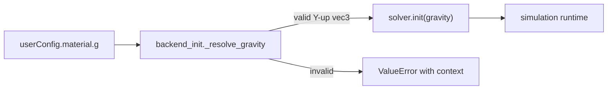

# Gravity 契约统一方案

## 目标与边界
- 目标：把“内部 Y-up，gravity 永远 -Y”变成**代码可执行契约**，而不是文档约定。
- 不做：不引入多余中间层，不做大规模重构，不改变外部配置语义（`material.g` 仍支持标量/向量）。
- 约束：局部复杂度低；相关逻辑放近；同类错误同类处理；接口稳定、实现可替换。

## 一致性设计（单一事实源 + 明确边界）
- 单一事实源保留在：[`/mnt/shared-storage-gpfs2/solution-gpfs02/liaoyuanjun/PhysGaussian/physics_sim/stages/backend_init.py`](/mnt/shared-storage-gpfs2/solution-gpfs02/liaoyuanjun/PhysGaussian/physics_sim/stages/backend_init.py) 的 `_resolve_gravity` 与 [`/mnt/shared-storage-gpfs2/solution-gpfs02/liaoyuanjun/PhysGaussian/physics_sim/utils/coord.py`](/mnt/shared-storage-gpfs2/solution-gpfs02/liaoyuanjun/PhysGaussian/physics_sim/utils/coord.py) 的 `gravity_vector`。
- 三个 solver 不再各自维护 Z-up 默认值（消除多事实源）：
  - [`/mnt/shared-storage-gpfs2/solution-gpfs02/liaoyuanjun/PhysGaussian/physics_sim/backend/newton_rigid/solver.py`](/mnt/shared-storage-gpfs2/solution-gpfs02/liaoyuanjun/PhysGaussian/physics_sim/backend/newton_rigid/solver.py)
  - [`/mnt/shared-storage-gpfs2/solution-gpfs02/liaoyuanjun/PhysGaussian/physics_sim/backend/newton_vbd/solver.py`](/mnt/shared-storage-gpfs2/solution-gpfs02/liaoyuanjun/PhysGaussian/physics_sim/backend/newton_vbd/solver.py)
  - [`/mnt/shared-storage-gpfs2/solution-gpfs02/liaoyuanjun/PhysGaussian/physics_sim/backend/newton_mpm/solver.py`](/mnt/shared-storage-gpfs2/solution-gpfs02/liaoyuanjun/PhysGaussian/physics_sim/backend/newton_mpm/solver.py)
- 在 solver 侧只保留“契约校验 + 失败即报错”，不再做方向猜测。

## 具体改造点（最小必要改动）
- 在 `backend_init._resolve_gravity` 统一处理 `material.g`：
  - `None`：使用 `coord.gravity_vector(|g|)`（Y-up）。
  - 标量：转成 `[0.0, -abs(g), 0.0]`（Y-up），并记录一次带上下文日志（backend 名、material id、原值）。
  - 向量：校验长度与数值合法性；若不满足 Y-up 契约直接抛 `ValueError`（包含配置路径与建议修复）。
- 在三个 solver 删除/替换 Z-up 硬编码默认值 `(0,0,-9.8)`，改为：
  - 接收已归一化 `gravity`；
  - 若缺失则抛错（禁止静默 fallback）；
  - `newton_rigid` 中标量分支 `g=[0,0,-abs(g)]` 改为 Y-up，或移除标量分支（由 `backend_init` 统一处理）。
- 错误信息统一模板（同类错误同类处理）：
  - `E_GRAVITY_SHAPE`：长度/类型错误；
  - `E_GRAVITY_AXIS`：非 Y-up；
  - `E_GRAVITY_MISSING`：调用链绕过初始化。
- 日志上下文统一字段：`backend`, `material_name/id`, `config_path`, `raw_g`, `resolved_g`。

## 数据流（改造后）

## 失败策略/兜底策略（显式）
- 兜底仅一处：`g is None` 或标量时在 `backend_init` 转 Y-up。
- 不做重试：配置错误是确定性错误，直接 fail-fast。
- 不降级到 Z-up：避免假成功。
- 不吞异常：所有 gravity 契约错误向上抛出，并带可定位上下文。

## 测试与验收
- 新增/更新测试覆盖两层：
  - `backend_init`：`None/标量/合法向量/非法向量` 四类输入。
  - solver 直调路径：绕过 `backend_init` 时缺失/非法 gravity 必须立即报错。
- 回归用例：同一配置在 `rigid/vbd/mpm` 的 gravity 解析结果一致。
- 验收标准：
  - 仓库内不再存在默认 Z-up gravity 字面量；
  - 错误可定位到具体 backend + material；
  - 直接实例化 solver 不会静默跑错方向。

## 为什么该方案符合你的代码质量要求
- 局部复杂度低：只改 gravity 相关节点，不扩散。
- 逻辑放近：解析在 stage 边界，执行在 solver，职责分明。
- 抽象层次一致：不新增“优雅但无价值”的中间层。
- 同类错误同类处理：统一错误码、统一消息模板、统一日志上下文。
- 依赖简单：公共接口不变（`material.g`），内部实现可替换。
- 假成功被消灭：所有非法输入都 fail-fast。