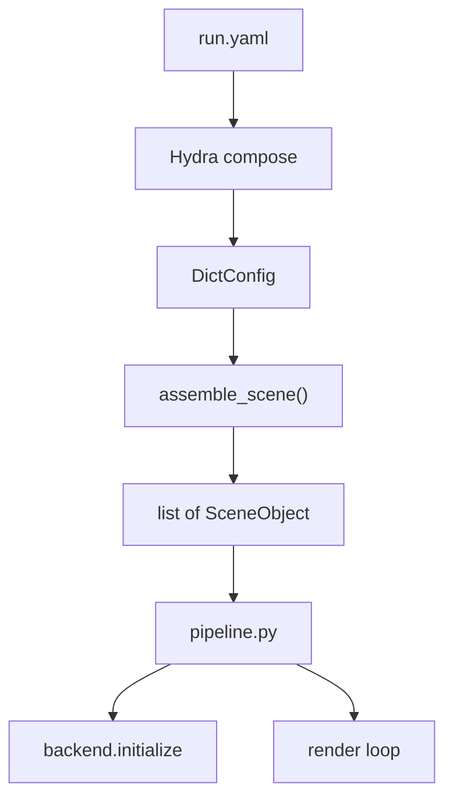

# 配置系统 + 多物体模型 统一重构计划

## 一、现状痛点总结

### 配置层

- 所有约定在 [`physics_sim/config/parser.py`](physics_sim/config/parser.py) 的 `decode_param_json` 中以 `.get(key, default)` 硬编码，返回 8 元组的松散 dict，新增字段就多一行 `.get`。
- [`phys_desc_to_config.py`](phys_desc_to_config.py) 维护另一套 `_BACKEND_DEFAULTS`，与 parser 双轨。
- `--ply_path` 在 CLI，`objects[].ply_path` 在 JSON，谁是「主 PLY」靠潜规则。

### 多物体数据流

[`pipeline.py`](pipeline.py) 490-848 行是 ~350 行的 if/else 面条：

- 三类物体（simulate / render_only / collider_only）各自一段 for 循环。
- 读 PLY、opacity filter、axis permutation、rotation、sim_area mask、position_offset、particle_filling、volume 估算、per_object_info 拼装……全部内联在 `main()` 里。
- 同一段 PLY 加载 + 过滤逻辑至少重复出现 4 次（shared PLY 选取、dedicated PLY simulate、render_only、collider_only）。
- 最终拼成 `sim_init_pos`、`per_object_info` 等松散变量，没有统一数据结构。

## 二、目标形态

### 用户视角

```bash
python pipeline.py --config experiments/wolf_bread_rigid.yaml
# 可选 CLI：--white_bg --compile_video --debug --no_render --raster_backend gsplat
```

**一份 YAML = 一次完整可复现的实验**，包含所有物体、材质、后端、相机、路径。

### 物体声明：三种 source 策略

```yaml
objects:
  - name: wolf
    mode: simulate
    source:
      type: ply                          # 策略 1：独立 PLY
      ply_path: model/wolf/point_cloud.ply
    material:
      ...

  - name: bread
    mode: simulate
    source:
      type: id_map                       # 策略 2（新）：共享 PLY + ID map
      shared_ply: model/scene/point_cloud.ply
      id_map: model/scene/gs_ids.npy     # (N,) int array, per-GS
      object_id: 3
    material:
      ...

  - name: ground
    mode: collider_only
    source:
      type: ply
      ply_path: model/ground/point_cloud.ply
    collider:
      type: plane
      ...
```

保留但弱化的旧策略（如有需要）：`type: sim_area`（从 shared PLY 用 AABB 切选）。

### 运行时数据结构：`SceneObject`

```python
@dataclass
class SceneObject:
    name: str
    mode: str                              # "simulate" | "render_only" | "collider_only"

    # GS 数据（opacity-filtered, axis-permuted, rotated）
    positions: torch.Tensor                # (N, 3) rotated world space
    covariances: torch.Tensor              # (N, 6)
    opacities: torch.Tensor                # (N, 1)
    shs: torch.Tensor                      # (N, C, 3)
    quats: torch.Tensor                    # (N, 4) wxyz
    scales: torch.Tensor                   # (N, 2|3)

    # 物理
    material: dict                         # 该物体的完整材质参数
    position_offset: list[float] | None    # 在 rotated space 里的偏移
    particle_filling: dict | None          # 可选

    # 碰撞代理（collider_only 或 simulate 需要的碰撞几何信息）
    collider: dict | None

    gs_type: str                           # "3dgs" | "2dgs"
```

### 装配阶段 `assemble_scene()`

输入：解析后的 DictConfig（OmegaConf）+ GaussianRenderer（用于读 PLY）。

职责：
1. **去重读 PLY**：收集所有 object source 中涉及的唯一 PLY 路径，批量加载一次，缓存。
2. **按 source 策略**分派 GS 粒子到各物体。
3. **统一预处理**：opacity filter -> axis permutation -> rotation（每个物体走同一条路径，不再 copy-paste）。
4. **输出** `list[SceneObject]`。

Pipeline 下游只看 `list[SceneObject]`，自行按 mode 分桶、concatenate、构建 `per_object_info`、送入 backend。

### 架构示意



## 三、配置系统设计

### 目录布局

```
physics_sim/conf/                  # Hydra config store (searchpath 目标)
  material/
    sand.yaml
    jelly.yaml
    rubber.yaml
  time/
    default.yaml                   # substep_dt, frame_dt, frame_num
    fast.yaml
  preprocess/
    default.yaml                   # opacity_threshold, rotation, axis_permutation, scale, transform_reference
  camera/
    orbit.yaml
    fixed.yaml
    json_cam.yaml
  backend/
    newton_rigid.yaml              # 含 solver opts, collision_geometry 等
    newton_mpm.yaml
    newton_vbd.yaml
    warp_mpm.yaml
```

### 根 YAML schema（概念）

```yaml
hydra:
  searchpath:
    - pkg://physics_sim.conf
defaults:
  - material: sand
  - time: default
  - preprocess: default
  - camera: orbit
  - backend: newton_rigid
  - _self_

# 场景级覆盖
material:
  E: 5.0e7

output: output/wolf_rigid

objects:
  - name: wolf
    mode: simulate
    source:
      type: ply
      ply_path: model/wolf/point_cloud.ply
    material:
      density: 500
      mu: 0.6

boundary_conditions:
  - type: surface_collider
    point: [1, 1, 0.2]
    normal: [0, 0, 1]
    surface: sticky
    friction: 0.6
```

### 配置加载流程

新模块 [`physics_sim/config/loader.py`](physics_sim/config/loader.py)：

```python
def load_config(yaml_path: str) -> DictConfig:
    """Hydra programmatic compose from an arbitrary file path."""
    config_dir = os.path.dirname(os.path.abspath(yaml_path))
    config_name = Path(yaml_path).stem
    with initialize_config_dir(config_dir=config_dir, version_base="1.3"):
        cfg = compose(config_name=config_name)
    return cfg
```

- 根 YAML 里的 `hydra.searchpath: [pkg://physics_sim.conf]` 让 Hydra 能解析 `defaults: [- material: sand]` 这类引用。
- 每个分组片段（如 `material/sand.yaml`）只含该组件的字段，Hydra merge 到顶层。

## 四、多物体装配器设计

新模块 [`physics_sim/scene/objects.py`](physics_sim/scene/objects.py)（或 `assembler.py`）。

### 核心函数签名

```python
def assemble_scene(
    cfg: DictConfig,
    renderer: GaussianRenderer,
    device: str = "cuda:0",
) -> list[SceneObject]:
```

### 内部流程

1. **收集唯一 PLY 路径**：遍历 `cfg.objects`，按 `source.type` 收集 `ply_path` / `shared_ply`，去重后用 `renderer.load_ply()` 批量加载，缓存到 `dict[str, PLYData]`。
2. **收集唯一 ID map 路径**：对 `source.type == "id_map"` 的物体，加载 `.npy`，缓存。
3. **分派 GS**（三条路径，统一调用同一个 `_extract_gs()` 辅助函数）：
   - `type: ply` — 直接取缓存的该 PLY 全部点。
   - `type: id_map` — 从缓存的 shared PLY 中，按 `id_map == object_id` mask 取子集。
   - `type: sim_area`（兼容旧模式） — 从缓存的 shared PLY 中，按 AABB mask 取子集。
4. **统一预处理**（对每个物体的 GS 数据）：
   - opacity filter（阈值可从物体级覆盖或用全局 `cfg.preprocess.opacity_threshold`）。
   - axis permutation。
   - rotation（`rotation_degree` + `rotation_axis`）。
   - `position_offset` 施加。
5. **材质继承**：`cfg.material`（顶层默认） deepmerge 物体级 `obj.material`。
6. **构造 `SceneObject`** 并 append。

### Pipeline 消费方式

```python
objects = assemble_scene(cfg, renderer)

sim_objects    = [o for o in objects if o.mode == "simulate"]
static_objects = [o for o in objects if o.mode == "render_only"]
collider_objects = [o for o in objects if o.mode == "collider_only"]

# 拼合模拟粒子
sim_pos = torch.cat([o.positions for o in sim_objects])
sim_vol = torch.cat([estimate_volumes(o.positions) for o in sim_objects])
sim_cov = torch.cat([o.covariances for o in sim_objects])

# per_object_info 由 sim_objects 的名称 + indices + material 构建
per_object_info = build_per_object_info(sim_objects)

backend.initialize(sim_pos, sim_vol, sim_cov, **init_kwargs)
material_params["per_object"] = per_object_info
backend.set_material(material_params)
```

这段逻辑取代了现在 pipeline.py 490-848 行的全部代码。

## 五、对现有后端接口的影响

后端接口 [`PhysicsBackend`](physics_sim/backend/base.py) 的 `initialize()` / `set_material()` / `set_boundary_conditions()` **签名不变**；变化只在上游如何准备传入的数据。

- `per_object_info` 结构不变：`[{name, particle_indices, material}, ...]`。
- `material_params` 顶层不变：后端仍用 `material_params.get("E")` 等。
- 新的 `id_map` source 策略对后端完全透明——装配阶段已经把 GS 粒子切好了。

## 六、`pipeline.py` 简化后的结构

重写后 `main()` 大致流程：

1. `argparse`：只保留 `--config`、`--white_bg`、`--compile_video`、`--no_render`、`--raster_backend`、`--sh_degree`、`--debug`、`--debug_log`。
2. `cfg = load_config(args.config)` — 获得完整 DictConfig。
3. `objects = assemble_scene(cfg, renderer)` — 获得 `list[SceneObject]`。
4. 按 mode 分桶，构建 `sim_init_pos` / `per_object_info` / `static_*`（~30 行）。
5. 初始化 backend、set_material、set_boundary_conditions、finalize（~40 行，基本不变）。
6. 渲染循环（不变）。

预计 pipeline.py 从 1348 行缩减到 ~600-700 行。

## 七、实施步骤

### Step 1: 基础设施

- 在 [`requirements.txt`](requirements.txt) 添加 `hydra-core` 和 `omegaconf`。
- 创建 `physics_sim/conf/` 目录骨架 + 各分组的 `default.yaml`。
- 创建 `physics_sim/conf/__init__.py`（使 `pkg://physics_sim.conf` searchpath 生效）。

### Step 2: SceneObject + assemble_scene

- 新建 `physics_sim/scene/__init__.py` + `physics_sim/scene/objects.py`。
- 实现 `SceneObject` dataclass。
- 实现 `assemble_scene()`，含三种 source 策略。
- 把 pipeline.py 中重复的 PLY 加载 / opacity filter / axis perm / rotation / sim_area 逻辑抽取到装配器的私有辅助函数中。

### Step 3: 配置 loader

- 新建 `physics_sim/config/loader.py`，实现 `load_config(yaml_path) -> DictConfig`。
- 确定 YAML schema 中所有顶层键与类型（material, time, preprocess, camera, backend, objects, boundary_conditions, output 等）。

### Step 4: 重写 pipeline.py

- CLI 瘦身：去掉 `--ply_path`、`--backend`（改从 `cfg.backend` 读）、`--cameras_json`、`--camera_mode`（改从 `cfg.camera` 读）。
- `main()` 改为调用 `load_config` -> `assemble_scene` -> backend init -> render loop。
- 删除旧 `decode_param_json` 调用和全部内联装配逻辑。

### Step 5: 示例 YAML + 验证

- 从 [`config/wolf_bread_rigid_config.json`](config/wolf_bread_rigid_config.json) 迁移出 `experiments/wolf_bread_rigid.yaml`。
- 从 [`config/wolf_bread_vbd_config.json`](config/wolf_bread_vbd_config.json) 迁移出 `experiments/wolf_bread_vbd.yaml`。
- 从 [`config/auto_config.json`](config/auto_config.json) 迁移出 `experiments/bench_auto.yaml`。
- 端到端验证 Newton rigid / VBD 可跑。

### Step 6: 清理

- 删除 [`physics_sim/config/parser.py`](physics_sim/config/parser.py) 中的 `decode_param_json`（或整个文件）。
- 旧 `config/*.json` 移到 `config/legacy/` 或删除。
- 更新 [`phys_desc_to_config.py`](phys_desc_to_config.py) 输出新 YAML 格式。
- 更新 [`physics_sim/config/__init__.py`](physics_sim/config/__init__.py) 导出。
