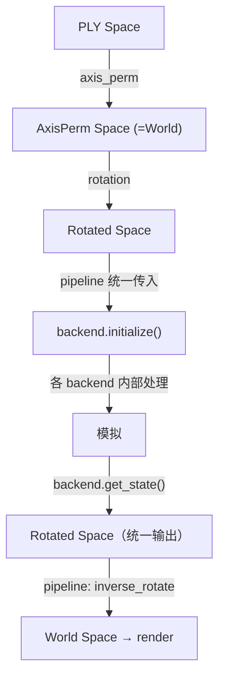

# Pipeline 移除归一化，下沉到 Backend

## 设计原则

**pipeline.py 完全不做归一化**，没有 if/else 分支。pipeline 统一在「旋转世界坐标」下工作。每个 backend 在自己的 `initialize()` / `get_state()` 内部处理自己的坐标需求。

## 目标坐标流



pipeline 中**不再出现** `transform2origin`、`shift2center111`、`scale_origin`、`undoshift2center111`、`undotransform2origin`、`world_to_mpm_positions`、`world_to_mpm_directions`。

## 改动详情

### 1. pipeline.py — 删减归一化逻辑

**移除的代码**（多物体路径 + 单物体路径 + 渲染循环 + no_render 路径）：

- `transform2origin()` / `transform_with_reference()` / `shift2center111()` 调用
- `scale_origin * scale_origin * cov` 缩放
- `fill_particles()` 调用
- `_compute_volumes()` 函数及其调用
- `init_filled_particles()` 调用
- `position_offset` 在 MPM 空间的应用（改为在旋转空间应用）
- 渲染循环中 `undoshift2center111` / `undotransform2origin` / `cov / scale²`
- 边界条件中 `world_to_mpm_positions` / `world_to_mpm_directions`
- `world_to_mpm_positions`、`world_to_mpm_directions`、`mpm_to_world_positions` 的 import

**保留的代码**：

- `apply_axis_permutation` — 共用
- `apply_rotations` / `apply_cov_rotations` — 共用（将场景对齐到 sim_area 选择空间）
- `sim_area` AABB 选择 — 共用
- `apply_inverse_rotations` / `apply_inverse_cov_rotations` — 渲染逆变换（只需要这一步）
- `preprocess_quats` / `inverse_preprocess_quats` — 共用（只涉及旋转）
- `generate_rotation_matrices` — 共用

**pipeline 传给 backend 的数据变化**：

- positions: 之前是 MPM [0,2]³ (gs+filled)，之后是旋转世界坐标 (gs only)
- covariances: 之前是旋转+缩放 (gs+filled)，之后是仅旋转 (gs only)
- volumes: 之前是 MPM 空间计算，之后是 dummy (backend 自行计算)
- boundary points: 之前是 MPM 空间，之后是旋转世界坐标

**新增传给 backend 的 kwargs**（通过现有 `**kwargs` 机制）：

```python
backend.initialize(
    rotated_pos_sim,       # 旋转世界坐标
    dummy_volumes,         # placeholder
    rotated_cov_sim,       # 仅旋转，不缩放
    n_grid=..., grid_lim=...,
    # 新增（仅 Warp MPM 使用）：
    opacity=init_opacity_sim,
    fill_params=filling_params,
    preprocess_scale=preprocessing_params["scale"],
)
```

### 2. WarpMPMBackend — 在 initialize()/get_state() 中加入归一化

[physics_sim/backend/warp_mpm/solver.py](physics_sim/backend/warp_mpm/solver.py) 改动：

**initialize() 新增逻辑**：

```python
def initialize(self, positions, volumes, covariances, **kwargs):
    # 1. 归一化位置到 [0,2]³
    scale = kwargs.get("preprocess_scale", 1.0)
    transformed, self._scale_origin, self._mean_pos = transform2origin(positions, scale)
    transformed = shift2center111(transformed)

    # 2. 缩放协方差
    scaled_cov = self._scale_origin ** 2 * covariances

    # 3. 粒子填充（如果配置了）
    fill_params = kwargs.get("fill_params")
    opacity = kwargs.get("opacity")
    self._gs_num = transformed.shape[0]
    if fill_params is not None and opacity is not None:
        mpm_pos = fill_particles(transformed, opacity, scaled_cov, ...)
    else:
        mpm_pos = transformed

    # 4. 计算体积
    mpm_vol = get_particle_volume(mpm_pos, ...)

    # 5. 构建完整 covariance 数组 (gs + filled)
    mpm_cov = zeros(mpm_pos.shape[0], 6)
    mpm_cov[:self._gs_num] = scaled_cov

    # 6. 交给现有的 MPM solver
    self._sim.load_initial_data_from_torch(mpm_pos, mpm_vol, ...)
```

**get_state() 新增逻辑**：

```python
def get_state(self):
    state = self._get_raw_state()  # 现有逻辑，返回 MPM 空间数据

    # 反归一化位置
    pos = undotransform2origin(undoshift2center111(state.positions),
                               self._scale_origin, self._mean_pos)
    # 反缩放协方差
    cov = state.covariances / (self._scale_origin ** 2)

    return SimulationState(positions=pos, covariances=cov,
                          rotations=state.rotations, ...)
```

需要新增 import：

```python
from physics_sim.preprocessing.transform import (
    transform2origin, shift2center111,
    undoshift2center111, undotransform2origin,
)
from physics_sim.preprocessing.particle_filling import (
    fill_particles, get_particle_volume,
)
```

### 3. NewtonMPMBackend — 自动计算 voxel_size

[physics_sim/backend/newton_mpm/solver.py](physics_sim/backend/newton_mpm/solver.py) 改动：

```python
def initialize(self, positions, volumes, covariances, *, n_grid=100, **kwargs):
    # 从粒子实际范围自动计算 voxel_size
    pos_np = positions.detach().cpu().numpy()
    extent = pos_np.max(axis=0) - pos_np.min(axis=0)
    max_extent = float(max(extent.max(), 1e-6))
    voxel_size = max_extent / n_grid
    self._solver_opts.voxel_size = voxel_size

    # 体积：简单均匀体积估算
    vol_np = np.full(n, voxel_size ** 3, dtype=np.float32)
    # ... 其余逻辑不变
```

- 移除 `grid_lim` 参数依赖（或保留为可选 override）
- 移除默认 z=0 地面平面
- `bounding_box` BC 改为基于粒子实际 bbox

### 4. Newton rigid / VBD — 无改动

这两个 backend 已经是坐标无关的，不需要任何修改。

### 5. 修复 bench_auto_0331.json

将 `"newton_vbd"` override key 改为 `"newton_rigid"`。

### 6. 渲染循环（pipeline.py）简化

之前（所有后端共用）：

```python
pos = apply_inverse_rotations(
    undotransform2origin(undoshift2center111(pos), scale_origin, original_mean_pos),
    rotation_matrices,
)
cov3D = cov3D / (scale_origin * scale_origin)
cov3D = apply_inverse_cov_rotations(cov3D, rotation_matrices)
```

之后（所有 backend 统一，无分支）：

```python
pos = apply_inverse_rotations(pos, rotation_matrices)
cov3D = apply_inverse_cov_rotations(cov3D, rotation_matrices)
```

## 不改动的部分

- **newton_rigid/solver.py** — 不动
- **newton_vbd/solver.py** — 不动
- **physics_sim/preprocessing/transform.py** — 不动
- **physics_sim/preprocessing/particle_filling.py** — 不动
- **physics_sim/config/parser.py** — 不动
- **warp_mpm/mpm_solver_warp.py、mpm_utils.py 等** — 不动（归一化逻辑在 solver.py wrapper 层处理）

## 风险与注意事项

- `position_offset` 语义变为世界坐标单位，已有配置值可能需要调整
- WarpMPMBackend 需要额外接收 `opacity`、`fill_params` 等参数（通过 kwargs）
- Warp MPM 的 `get_state()` 现在返回的粒子数 > `gs_num`（含填充粒子），pipeline 仍然用 `[:gs_num]` 切片——这和之前一致
- Newton MPM 的体积估算改为 `voxel_size³` 的均匀值（简化），如需更精确可后续引入 scipy/numpy 版本的体积估算
