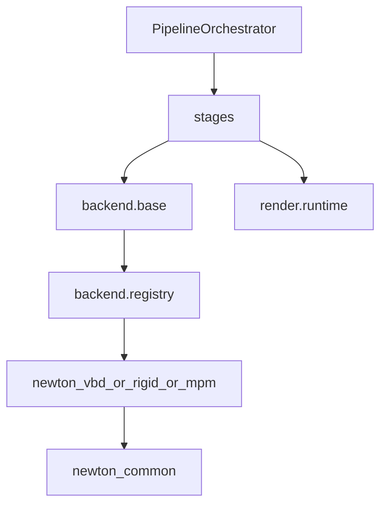

# physics_sim 单体巨文件治理计划（专项体检）

## 体检结论（按优先级）

- 高风险热点（优先治理）：
  - `[/mnt/shared-storage-gpfs2/solution-gpfs02/liaoyuanjun/PhysGaussian/physics_sim/stages/sim_loop.py](/mnt/shared-storage-gpfs2/solution-gpfs02/liaoyuanjun/PhysGaussian/physics_sim/stages/sim_loop.py)`：`run_with_rendering` 同时处理仿真步进、诊断、渲染拼装、OpenCV 写盘，抽象层次混杂。
  - `[/mnt/shared-storage-gpfs2/solution-gpfs02/liaoyuanjun/PhysGaussian/physics_sim/stages/backend_init.py](/mnt/shared-storage-gpfs2/solution-gpfs02/liaoyuanjun/PhysGaussian/physics_sim/stages/backend_init.py)`：后端创建、材质组装、重力解析、碰撞体平面拟合、world→internal 坐标变换集中在单函数链路。
  - `[/mnt/shared-storage-gpfs2/solution-gpfs02/liaoyuanjun/PhysGaussian/physics_sim/backend/newton_vbd/solver.py](/mnt/shared-storage-gpfs2/solution-gpfs02/liaoyuanjun/PhysGaussian/physics_sim/backend/newton_vbd/solver.py)`：文件体量最大，生命周期编排与软体网格/四面体细节耦合。
- 中风险热点：
  - `[/mnt/shared-storage-gpfs2/solution-gpfs02/liaoyuanjun/PhysGaussian/physics_sim/backend/newton_rigid/solver.py](/mnt/shared-storage-gpfs2/solution-gpfs02/liaoyuanjun/PhysGaussian/physics_sim/backend/newton_rigid/solver.py)`
  - `[/mnt/shared-storage-gpfs2/solution-gpfs02/liaoyuanjun/PhysGaussian/physics_sim/backend/newton_mpm/solver.py](/mnt/shared-storage-gpfs2/solution-gpfs02/liaoyuanjun/PhysGaussian/physics_sim/preprocessing/particle_filling.py)`

## 目标边界（防止过度封装）

- 保持稳定公共接口：`[/mnt/shared-storage-gpfs2/solution-gpfs02/liaoyuanjun/PhysGaussian/physics_sim/backend/base.py](/mnt/shared-storage-gpfs2/solution-gpfs02/liaoyuanjun/PhysGaussian/physics_sim/backend/base.py)` 的 `PhysicsBackend` / `SimulationState` 不扩散新中间层。
- 只拆“高复杂+高变更”块，不做形式化分层；每次拆分最多引入 1 个薄模块（避免“优雅驱动”的空抽象）。
- 统一依赖方向：`stages -> backend API -> backend impl/common`，`render` 不回灌到 backend。

## 分阶段治理

### Phase A：先拆跨层上帝函数（最高收益）

- `sim_loop` 拆为 3 个近邻函数：
  - `advance_simulation_substeps(...)`
  - `compose_render_inputs(...)`
  - `write_frame_output(...)`
- `backend_init` 拆为 3 个纯函数群：
  - 材质决议（含 gravity）
  - BC 规范化（统一 world/internal）
  - backend 生命周期编排（initialize/set_material/set_boundary_conditions/finalize）
- 验收：主入口函数长度显著下降，且每段只做单一抽象层工作。

### Phase B：收敛三大 solver 的职责边界

- `newton_vbd/solver.py`：保留生命周期与 orchestration；软体网格规格/拓扑重建逻辑下沉到同目录专用模块（就近放置）。
- `newton_rigid/solver.py` 与 `newton_mpm/solver.py`：按“材料决议/边界条件/状态导出”切分到已有邻近文件（优先复用现有 `materials.py`、`boundary_conditions.py`、`state_export.py`，不再造层）。
- 验收：solver 文件只剩组装与调用，算法细节在同子包可替换。

### Phase C：清理离散语义与隐式契约

- 统一 `get_diagnostics` 契约：要么纳入 `PhysicsBackend` 默认空实现，要么移出主循环为可选 observer，禁止 `hasattr` 隐式协议。
- 统一 BC 坐标语义入口（单点转换），backend 仅接收 internal 语义。
- 验收：同一概念单一归口，新增 BC/重力规则不需要跨 stage+backend 双改。

### Phase D：建立“复杂度不回弹”门禁

- 对 `physics_sim` 增加轻量门禁（脚本或 CI 检查）：
  - 单文件软阈值：`>300` 行告警
  - 单函数软阈值：`>80` 行告警
  - 嵌套深度阈值：`>4` 告警
- 验收：新增改动触发告警后必须解释或拆分。

## 目标依赖图

## 执行顺序与风险控制

- 先 `Phase A`（改动集中且收益最高），再 `Phase B`（结构重塑），最后 `Phase C/D`（契约固化与门禁）。
- 每阶段只动一条主链路（例如先 `sim_loop`，再 `backend_init`），避免并行大拆导致回归定位困难。

