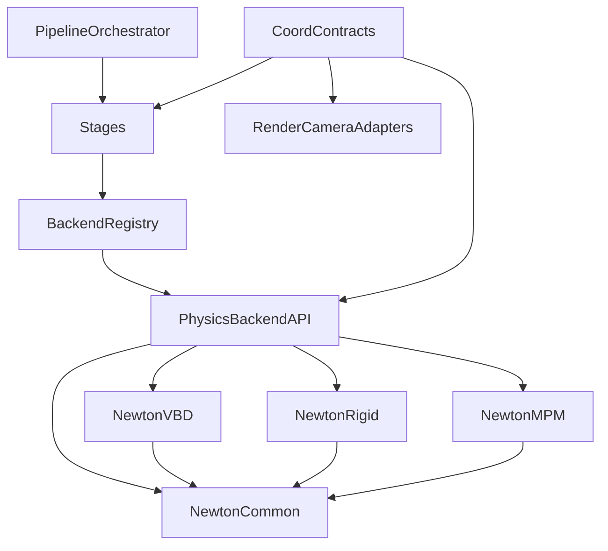

# physics_sim 单体拆分优先重构计划

## 目标与约束
- 目标：降低局部复杂度、靠近相关逻辑、统一抽象层次、减少重复实现、明确模块边界、稳定公共接口。
- 策略：按你选择的“单体优先 + 积极清理”推进，允许修正历史不一致行为，不以“完全兼容旧行为”为前提。
- 重构聚焦文件：
  - [`/mnt/shared-storage-gpfs2/solution-gpfs02/liaoyuanjun/PhysGaussian/physics_sim/backend/newton_vbd/solver.py`](/mnt/shared-storage-gpfs2/solution-gpfs02/liaoyuanjun/PhysGaussian/physics_sim/backend/newton_vbd/solver.py)
  - [`/mnt/shared-storage-gpfs2/solution-gpfs02/liaoyuanjun/PhysGaussian/physics_sim/backend/newton_rigid/solver.py`](/mnt/shared-storage-gpfs2/solution-gpfs02/liaoyuanjun/PhysGaussian/physics_sim/backend/newton_rigid/solver.py)
  - [`/mnt/shared-storage-gpfs2/solution-gpfs02/liaoyuanjun/PhysGaussian/physics_sim/backend/newton_mpm/solver.py`](/mnt/shared-storage-gpfs2/solution-gpfs02/liaoyuanjun/PhysGaussian/physics_sim/backend/newton_mpm/solver.py)
  - [`/mnt/shared-storage-gpfs2/solution-gpfs02/liaoyuanjun/PhysGaussian/physics_sim/coord.py`](/mnt/shared-storage-gpfs2/solution-gpfs02/liaoyuanjun/PhysGaussian/physics_sim/coord.py)
  - [`/mnt/shared-storage-gpfs2/solution-gpfs02/liaoyuanjun/PhysGaussian/physics_sim/stages/backend_init.py`](/mnt/shared-storage-gpfs2/solution-gpfs02/liaoyuanjun/PhysGaussian/physics_sim/stages/backend_init.py)

## 现状问题（已确认）
- `newton_vbd/solver.py`、`newton_rigid/solver.py`、`newton_mpm/solver.py` 职责混杂（初始化、几何构建、状态导出、材质/BC、数值辅助耦合在单文件）。
- VBD/Rigid 存在明显重复 helper（四元数、协方差打包等），后续维护易漂移。
- 错误处理与日志风格不统一（大量 `print`，部分分支降级策略不透明）。
- 中心模块 `coord.py` 扇出较大，仿真/重力契约/相机辅助混放。

## 重构分阶段

### Phase 1：拆“通用数学与状态转换”公共层（先减重复）
- 在 `physics_sim/backend` 下建立 `newton_common`（或等价命名）子模块，迁移 VBD/Rigid 重复的四元数与协方差转换函数。
- 明确单一约定（四元数分量顺序、矩阵乘法方向、协方差打包顺序），禁止后端私有再拷贝。
- `newton_vbd/solver.py` 与 `newton_rigid/solver.py` 仅保留调用，不再内置重复 helper。

### Phase 2：按职责拆分 VBD 与 Rigid 巨文件（核心）
- VBD 拆为：
  - `barycentric.py`（重心坐标与退化处理）
  - `rigid_mesh.py`（碰撞网格构建与降级策略）
  - `state_export.py`（`get_state` 聚焦输出）
  - `solver.py`（仅编排生命周期）
- Rigid 拆为：
  - `collider_builders.py`（各种 collider 构建）
  - `state_export.py`
  - `solver.py`（编排）
- 要求：每个文件单一职责，单函数控制分支深度，复杂分支下沉到私有函数。

### Phase 3：拆分 MPM 巨文件并对齐关键语义
- `newton_mpm/solver.py` 拆为：
  - `materials.py`（材质映射、摩擦/屈服参数）
  - `boundary_conditions.py`（所有 BC 解析与注册）
  - `state_export.py`（F→R/quat/scale 输出桥接）
  - `solver.py`（编排）
- 清理当前“全局材质 vs per_object 材质”双规则，统一为单路径决议。
- 明确并统一 `surface_collider`/`bounding_box` 参数语义（积极清理模式下允许改变旧默认）。

### Phase 4：统一错误处理、日志与降级契约
- 引入模块级 logger，替换关键路径 `print`。
- 统一同类错误：
  - 参数错误：`ValueError`（含定位字段）
  - 运行态不合法：`RuntimeError`
  - 外部依赖缺失：`ImportError/ModuleNotFoundError`（附安装建议）
- 降级策略显式化：每次降级都记录“触发条件 + 原因 + 结果”；禁止静默跳过导致假成功。

### Phase 5：边界收敛与接口稳定
- 明确“外部稳定接口”与“内部可替换实现”：
  - `PhysicsBackend` 对外方法签名稳定。
  - 新拆出的实现模块均标注内部接口，不对上层泄漏。
- 将 `coord.py` 的相机辅助与重力契约分域，避免继续膨胀成中心巨石。

### Phase 6：回归与质量门禁
- 新增/扩展测试覆盖：
  - 后端间关键配置语义一致性测试（材质、BC、重力）
  - 状态导出一致性测试（2DGS quat/scale、协方差）
  - 降级策略与错误信息可定位测试
- 对重构后文件执行复杂度与长度约束（函数最大长度、单文件大小软阈值）。

## 依赖关系目标图

## 完成标准
- 三个 solver 主文件显著瘦身（只保留编排与生命周期）。
- 跨后端重复 helper 收敛到单一实现。
- 错误与日志具备可定位上下文，降级路径可追踪。
- 公共接口稳定，内部拆分后可独立替换实现。