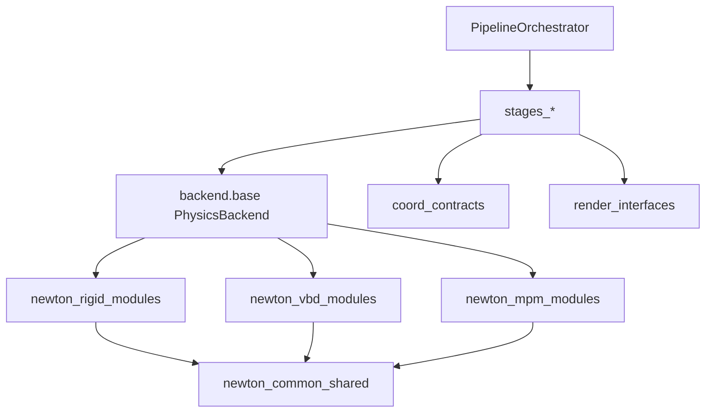

# physics_sim 质量治理与拆分计划

## 范围与目标
- 范围：`physics_sim` 全量（含 backend、stages、coord、render、preprocessing）。
- 策略：激进式重构，允许调整公共接口，但要求迁移路径清晰且可回归验证。
- 目标对齐你的标准：
  - 局部复杂度下降（巨文件拆分、函数职责收敛）
  - 相关逻辑就近（边界条件/重力/变换统一归口）
  - 抽象层次一致（编排层、契约层、实现层分离）
  - 避免过度封装（仅抽“稳定重复点”，不制造空中间层）
  - 同类错误同类处理（统一异常类型与消息结构）
  - 依赖关系清晰（单向依赖、边界明确、内部可替换）

## 当前主要问题（已定位）
- 巨文件与职责混杂：
  - [`/mnt/shared-storage-gpfs2/solution-gpfs02/liaoyuanjun/PhysGaussian/physics_sim/backend/newton_vbd/solver.py`](/mnt/shared-storage-gpfs2/solution-gpfs02/liaoyuanjun/PhysGaussian/physics_sim/backend/newton_vbd/solver.py)
  - [`/mnt/shared-storage-gpfs2/solution-gpfs02/liaoyuanjun/PhysGaussian/physics_sim/preprocessing/particle_filling.py`](/mnt/shared-storage-gpfs2/solution-gpfs02/liaoyuanjun/PhysGaussian/physics_sim/preprocessing/particle_filling.py)
  - [`/mnt/shared-storage-gpfs2/solution-gpfs02/liaoyuanjun/PhysGaussian/physics_sim/backend/newton_rigid/solver.py`](/mnt/shared-storage-gpfs2/solution-gpfs02/liaoyuanjun/PhysGaussian/physics_sim/backend/newton_rigid/solver.py)
  - [`/mnt/shared-storage-gpfs2/solution-gpfs02/liaoyuanjun/PhysGaussian/physics_sim/coord.py`](/mnt/shared-storage-gpfs2/solution-gpfs02/liaoyuanjun/PhysGaussian/physics_sim/coord.py)
  - [`/mnt/shared-storage-gpfs2/solution-gpfs02/liaoyuanjun/PhysGaussian/physics_sim/render/camera.py`](/mnt/shared-storage-gpfs2/solution-gpfs02/liaoyuanjun/PhysGaussian/physics_sim/render/camera.py)
- 重复实现明显：边界平面/摩擦解析、刚体状态导出、刚体几何构建在多个 backend 分叉。
- 错误处理不一致：`assert`、`ValueError`、`RuntimeError`、`KeyError` 混用；日志与 `print` 混用。
- 可定位性缺口：部分降级分支 `except Exception` 仅 warning，缺结构化上下文。
- 已知逻辑漏洞：
  - [`/mnt/shared-storage-gpfs2/solution-gpfs02/liaoyuanjun/PhysGaussian/physics_sim/backend/newton_mpm/solver.py`](/mnt/shared-storage-gpfs2/solution-gpfs02/liaoyuanjun/PhysGaussian/physics_sim/backend/newton_mpm/solver.py) 中 `finalize()` 对 `self._material_params is None` 的检查与初始化值 `{}` 语义不一致，导致“必须先 set_material”校验不可达。

## 目标架构（拆分后）

## 分阶段实施

### 阶段 1：统一错误与契约（先止血）
- 统一“配置错误/契约错误/调用顺序错误”异常模型（同类错误同类处理）。
- 将关键前置条件从 `assert` 改为显式异常，保留可定位上下文（backend、config_path、object/material）。
- 统一注册表未知项异常类型：
  - [`/mnt/shared-storage-gpfs2/solution-gpfs02/liaoyuanjun/PhysGaussian/physics_sim/backend/registry.py`](/mnt/shared-storage-gpfs2/solution-gpfs02/liaoyuanjun/PhysGaussian/physics_sim/backend/registry.py)
  - [`/mnt/shared-storage-gpfs2/solution-gpfs02/liaoyuanjun/PhysGaussian/physics_sim/render/registries.py`](/mnt/shared-storage-gpfs2/solution-gpfs02/liaoyuanjun/PhysGaussian/physics_sim/render/registries.py)
- 将 [`/mnt/shared-storage-gpfs2/solution-gpfs02/liaoyuanjun/PhysGaussian/physics_sim/stages/backend_init.py`](/mnt/shared-storage-gpfs2/solution-gpfs02/liaoyuanjun/PhysGaussian/physics_sim/stages/backend_init.py) 的 `print` 收敛到 logger。
- 修复 MPM `finalize` 前置条件漏洞，确保接口语义真实可执行。

### 阶段 2：高收益去重（不牺牲语义）
- 抽取边界平面与摩擦公共逻辑（Rigid/VBD/MPM 复用）。
- 抽取“刚体粒子状态导出”公共流程（Rigid/VBD 复用，支持 NaN 策略参数）。
- 合并/归一刚体几何构建路径：
  - [`/mnt/shared-storage-gpfs2/solution-gpfs02/liaoyuanjun/PhysGaussian/physics_sim/backend/newton_rigid/collider_builders.py`](/mnt/shared-storage-gpfs2/solution-gpfs02/liaoyuanjun/PhysGaussian/physics_sim/backend/newton_rigid/collider_builders.py)
  - [`/mnt/shared-storage-gpfs2/solution-gpfs02/liaoyuanjun/PhysGaussian/physics_sim/backend/newton_vbd/rigid_mesh.py`](/mnt/shared-storage-gpfs2/solution-gpfs02/liaoyuanjun/PhysGaussian/physics_sim/backend/newton_vbd/rigid_mesh.py)
- 对“必须保留分叉”的实现（如不同设备/四元数约定）补充边界注释与命名规范，避免误抽象。

### 阶段 3：巨文件拆分与模块边界重建
- 拆分 solver：
  - [`/mnt/shared-storage-gpfs2/solution-gpfs02/liaoyuanjun/PhysGaussian/physics_sim/backend/newton_vbd/solver.py`](/mnt/shared-storage-gpfs2/solution-gpfs02/liaoyuanjun/PhysGaussian/physics_sim/backend/newton_vbd/solver.py)
  - [`/mnt/shared-storage-gpfs2/solution-gpfs02/liaoyuanjun/PhysGaussian/physics_sim/backend/newton_rigid/solver.py`](/mnt/shared-storage-gpfs2/solution-gpfs02/liaoyuanjun/PhysGaussian/physics_sim/backend/newton_rigid/solver.py)
  - [`/mnt/shared-storage-gpfs2/solution-gpfs02/liaoyuanjun/PhysGaussian/physics_sim/backend/newton_mpm/solver.py`](/mnt/shared-storage-gpfs2/solution-gpfs02/liaoyuanjun/PhysGaussian/physics_sim/backend/newton_mpm/solver.py)
- 拆分基础设施：
  - [`/mnt/shared-storage-gpfs2/solution-gpfs02/liaoyuanjun/PhysGaussian/physics_sim/coord.py`](/mnt/shared-storage-gpfs2/solution-gpfs02/liaoyuanjun/PhysGaussian/physics_sim/coord.py)
  - [`/mnt/shared-storage-gpfs2/solution-gpfs02/liaoyuanjun/PhysGaussian/physics_sim/render/camera.py`](/mnt/shared-storage-gpfs2/solution-gpfs02/liaoyuanjun/PhysGaussian/physics_sim/render/camera.py)
  - [`/mnt/shared-storage-gpfs2/solution-gpfs02/liaoyuanjun/PhysGaussian/physics_sim/preprocessing/particle_filling.py`](/mnt/shared-storage-gpfs2/solution-gpfs02/liaoyuanjun/PhysGaussian/physics_sim/preprocessing/particle_filling.py)
- 原则：按“契约层/编排层/算法层/数据结构层”拆，避免为拆而拆。

### 阶段 4：接口稳定化与迁移收口
- 明确并冻结对外入口契约：`PhysicsBackend` 生命周期、`initialize` 参数契约、registry 接口。
- 为激进变更提供兼容层/迁移提示（短期 alias 或参数适配器）。
- 在文档中标注公共 API 与内部模块边界，确保内部实现可替换。

## 验证与回归
- 扩展/新增测试：
  - 重力与错误契约（扩展 [`/mnt/shared-storage-gpfs2/solution-gpfs02/liaoyuanjun/PhysGaussian/tests/test_gravity_contract.py`](/mnt/shared-storage-gpfs2/solution-gpfs02/liaoyuanjun/PhysGaussian/tests/test_gravity_contract.py)）
  - registry 错误类型一致性
  - backend 生命周期顺序约束（initialize/set_material/finalize/step）
  - 边界条件与几何降级路径（严格模式与降级模式）
- 每阶段交付要求：
  - 行为回归通过
  - 新增错误消息可定位（含 backend + config_path + object/material）
  - 模块依赖图无新增反向耦合

## 交付顺序（建议）
- 先做阶段 1（风险最低、收益立竿见影）。
- 再做阶段 2（去重复并固化共享逻辑）。
- 最后做阶段 3（结构性拆分）与阶段 4（迁移收口）。