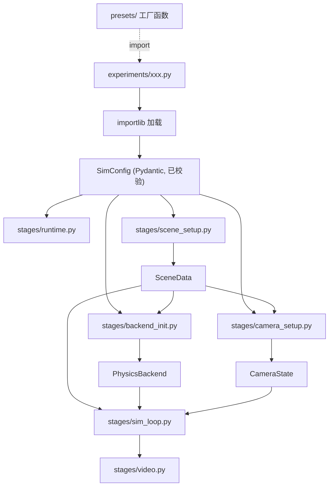

# Pipeline 与配置系统重新设计 (Python-first)

## 一、核心思路：干掉 ConfigLoader

**旧路径** (面条)：YAML -> `_ref` 解析 -> deep-merge -> string-or-dict 多态 -> dict -> 祈祷运行时不报错

**新路径** (直接)：Python 文件直接构造 Pydantic 对象 -> 类型安全 -> 完成

没有 ConfigLoader，没有 `_ref`，没有 deep-merge。复用就是 Python `import`。

---

## 二、用户视角：一个实验配置长什么样

```python
# experiments/wolf_bread_rigid.py
from physics_sim.config.models import *
from physics_sim.presets.objects import wolf, bread
from physics_sim.presets.materials import rubber
from physics_sim.presets.backends import newton_rigid
from physics_sim.presets.cameras import orbit_camera

config = SimConfig(
    output="output/wolf_bread_rigid",
    backend=newton_rigid(),
    time=TimeConfig(substep_dt=1e-3),
    camera=orbit_camera(init_azimuth=90, init_elevation=20, init_radius=3.0),
    objects=[
        wolf(material=rubber(density=500, mu=0.6)),
        bread(
            transform=ObjectTransform(position=(0, 0, 1.5)),
            material=rubber(density=300, mu=0.3),
        ),
    ],
    boundary_conditions=[
        SurfaceCollider(point=(1, 1, 0.2), normal=(0, 0, 1), surface="sticky", friction=0.6),
    ],
)
```

运行：
```bash
python pipeline.py --config experiments/wolf_bread_rigid.py
python pipeline.py --config experiments/wolf_bread_rigid.py --white_bg --compile_video
```

### 复用是自然的 Python import

```python
# experiments/wolf_bread_vbd.py
from physics_sim.presets.objects import wolf, bread
from physics_sim.presets.materials import rubber, soft_body
from physics_sim.presets.backends import newton_vbd

config = SimConfig(
    backend=newton_vbd(soft_contact_ke=100.0),
    objects=[
        wolf(material=rubber(physics="rigid", collision_geometry="convex_hull")),
        bread(material=soft_body(density=300, k_mu=1e5)),
    ],
    ...
)
```

同一个 `wolf()` 在两个实验中复用，只是传了不同的 material。零魔法。

---

## 三、文件结构

```
physics_sim/
  config/
    models.py          # Pydantic 模型 (核心，全部类型定义)
    loader.py          # load_config(path: str) -> SimConfig (仅 importlib 加载 .py)

  presets/             # [新增] 预设工厂函数 (取代 conf/ YAML)
    __init__.py        # re-export 常用预设
    objects.py         # wolf(), bread(), bench_inst() 等
    materials.py       # rubber(), sand(), jelly(), soft_body() 等
    backends.py        # newton_rigid(), newton_vbd(), newton_mpm()
    cameras.py         # orbit_camera(), fixed_camera(), json_camera()
    time.py            # default_time(), fast_time()
    fillings.py        # default_filling(), dense_filling()

  backend/
    base.py            # (保留)
    none.py            # [新增] NoneBackend (从 pipeline.py 移出)
    registry.py        # [新增] create_backend() 工厂 + BACKEND_MATERIAL_DEFAULTS
    newton_mpm/        # (保留)
    newton_rigid/      # (保留)
    newton_vbd/        # (保留)
    warp_mpm/          # (标记 deprecated，不再引用)

  scene/
    objects.py         # SceneObject (role 替代 mode, 增加 initial_velocity)
    assembler.py       # assemble_scene() 适配新 ObjectConfig

  stages/              # [新增] pipeline 拆分为独立阶段
    __init__.py
    runtime.py         # init_runtime(backend_type)
    scene_setup.py     # setup_scene(cfg, renderer) -> SceneData
    backend_init.py    # init_backend(cfg, scene_data) -> PhysicsBackend
    camera_setup.py    # setup_camera(cfg, scene_data) -> CameraState
    sim_loop.py        # run_headless() / run_with_rendering()
    video.py           # compile_video()

  # (保留不变)
  geometry/
  preprocessing/
  renderer/

experiments/           # 实验配置 (.py 文件)
  wolf_bread_rigid.py
  wolf_bread_vbd.py
  wolf_sand.py
  bench_auto_vbd.py

pipeline.py            # 瘦身入口 (~80 行)
```

### 删除/废弃

- `physics_sim/config/schema.py` -- 被 `models.py` 取代
- `physics_sim/config/loader.py` (旧版) -- 被新的 10 行 loader 取代
- `physics_sim/conf/` 整个目录 -- 被 `presets/` 模块取代
- `experiments/*.yaml` -- 迁移为 `.py` 后删除

---

## 四、Pydantic 配置模型 (`config/models.py`)

### 设计原则

- **每个字段都有明确类型和默认值** -- 写错字段名 Pydantic 立即报错
- **没有 `dict[str, Any]` 万能口袋** -- backend 参数也有类型
- **material 是 dict** -- 因为不同 backend 需要不同字段，但预设函数提供 IDE 自动补全

### 核心模型

```python
from pydantic import BaseModel
from typing import Literal

# ── 数据源 ──
class PlySource(BaseModel):
    type: Literal["ply"] = "ply"
    ply_path: str

class IdMapSource(BaseModel):
    type: Literal["id_map"] = "id_map"
    ply_path: str
    id_map: str
    object_id: int

# ── 变换 ──
class ObjectTransform(BaseModel):
    position: tuple[float, float, float] = (0.0, 0.0, 0.0)
    rotation_degrees: tuple[float, float, float] = (0.0, 0.0, 0.0)

# ── 碰撞体 ──
class ColliderConfig(BaseModel):
    type: str = "plane"
    space: str = "world"
    surface: str = "slip"
    friction: float = 0.0
    point: tuple[float, float, float] | None = None
    normal: tuple[float, float, float] | None = None
    render: bool = True

# ── 物体 ──
class ObjectConfig(BaseModel):
    name: str
    source: PlySource | IdMapSource
    role: Literal["dynamic", "collider_only", "render_only"] = "dynamic"
    transform: ObjectTransform = ObjectTransform()
    initial_velocity: tuple[float, float, float] = (0.0, 0.0, 0.0)
    material: dict = {}
    particle_filling: dict | None = None
    collider: ColliderConfig | None = None
    opacity_threshold: float | None = None

# ── Backend (每种 backend 一个类型，带类型安全) ──
class NewtonRigidConfig(BaseModel):
    type: Literal["newton_rigid"] = "newton_rigid"
    n_grid: int = 200
    grid_lim: float = 2.0
    collision_geometry: str = "convex_hull"
    use_sdf: bool = False
    contact_margin: float = 0.01
    solver_iterations: int = 10
    contact_relaxation: float = 0.8

class NewtonVBDConfig(BaseModel):
    type: Literal["newton_vbd"] = "newton_vbd"
    n_grid: int = 200
    grid_lim: float = 2.0
    collision_geometry: str = "convex_hull"
    contact_margin: float = 0.01
    soft_contact_ke: float = 100.0
    solver_iterations: int = 20

class NewtonMPMConfig(BaseModel):
    type: Literal["newton_mpm"] = "newton_mpm"
    n_grid: int = 200

class NoneBackendConfig(BaseModel):
    type: Literal["none"] = "none"

BackendConfig = NewtonRigidConfig | NewtonVBDConfig | NewtonMPMConfig | NoneBackendConfig

# ── 时间/预处理/相机 ──
class TimeConfig(BaseModel):
    substep_dt: float = 1e-4
    frame_dt: float = 1e-2
    frame_num: int = 100

class PreprocessConfig(BaseModel):
    opacity_threshold: float = 0.02
    axis_permutation: str = "xyz"
    rotation_degree: list[float] = [0.0]
    rotation_axis: list[int] = [0]
    scale: float = 1.0

class CameraConfig(BaseModel):
    camera_mode: Literal["orbit", "fixed", "json"] = "orbit"
    width: int | None = None
    height: int | None = None
    # ... 所有相机字段，全部有默认值 ...

# ── 边界条件 ──
class SurfaceCollider(BaseModel):
    type: Literal["surface_collider"] = "surface_collider"
    point: tuple[float, float, float]
    normal: tuple[float, float, float]
    surface: str = "slip"
    friction: float = 0.0
    space: str = "world"
    start_time: float = 0.0
    end_time: float = 1e3

class BoundingBox(BaseModel):
    type: Literal["bounding_box"] = "bounding_box"

BoundaryCondition = SurfaceCollider | BoundingBox  # 可扩展

# ── 顶层 ──
class SimConfig(BaseModel):
    output: str = "output"
    backend: BackendConfig
    time: TimeConfig = TimeConfig()
    preprocess: PreprocessConfig = PreprocessConfig()
    camera: CameraConfig = CameraConfig()
    objects: list[ObjectConfig]
    boundary_conditions: list[BoundaryCondition] = []
```

---

## 五、预设函数 (`presets/`)

预设函数是普通的 Python 工厂函数。提供 IDE 自动补全，但没有任何魔法。

### `presets/materials.py`

```python
def rubber(density=1100, mu=0.5, E=1e6, nu=0.45, **kw) -> dict:
    return dict(density=density, mu=mu, E=E, nu=nu, **kw)

def sand(density=2000, E=5e7, nu=0.3, friction_angle=30, **kw) -> dict:
    return dict(density=density, E=E, nu=nu, friction_angle=friction_angle, **kw)

def soft_body(density=300, k_mu=1e5, k_lambda=1e5, k_damp=1e-3, **kw) -> dict:
    return dict(physics="soft", density=density, k_mu=k_mu, k_lambda=k_lambda, k_damp=k_damp, **kw)
```

### `presets/objects.py`

```python
from physics_sim.config.models import ObjectConfig, PlySource, ObjectTransform
from physics_sim.presets.materials import rubber

def wolf(
    material: dict | None = None,
    role: str = "dynamic",
    transform: ObjectTransform | None = None,
    **kw,
) -> ObjectConfig:
    return ObjectConfig(
        name="wolf",
        source=PlySource(ply_path="model/wolf_whitebg-trained/point_cloud/iteration_30000/point_cloud.ply"),
        role=role,
        material=material or rubber(),
        transform=transform or ObjectTransform(),
        **kw,
    )

def bread(
    material: dict | None = None,
    transform: ObjectTransform | None = None,
    **kw,
) -> ObjectConfig:
    return ObjectConfig(
        name="bread",
        source=PlySource(ply_path="model/bread-trained/point_cloud/iteration_30000/point_cloud.ply"),
        material=material or rubber(),
        transform=transform or ObjectTransform(),
        **kw,
    )
```

### `presets/backends.py`

```python
from physics_sim.config.models import NewtonRigidConfig, NewtonVBDConfig, NewtonMPMConfig

def newton_rigid(**kw) -> NewtonRigidConfig:
    return NewtonRigidConfig(**kw)

def newton_vbd(**kw) -> NewtonVBDConfig:
    return NewtonVBDConfig(**kw)

def newton_mpm(**kw) -> NewtonMPMConfig:
    return NewtonMPMConfig(**kw)
```

---

## 六、配置加载 (`config/loader.py`)

整个 loader 只有 ~15 行，没有任何解析魔法：

```python
import importlib.util
from physics_sim.config.models import SimConfig

def load_config(path: str) -> SimConfig:
    spec = importlib.util.spec_from_file_location("_exp_config", path)
    module = importlib.util.module_from_spec(spec)
    spec.loader.exec_module(module)
    cfg = getattr(module, "config", None)
    if cfg is None:
        raise ValueError(f"{path} must define a top-level `config` variable")
    if not isinstance(cfg, SimConfig):
        raise TypeError(f"`config` in {path} must be SimConfig, got {type(cfg)}")
    return cfg
```

---

## 七、Backend 材质默认值 (`backend/registry.py`)

```python
BACKEND_MATERIAL_DEFAULTS = {
    "newton_rigid": dict(density=1000, mu=0.5, E=1e5, nu=0.3, collision_geometry="convex_hull"),
    "newton_vbd":   dict(density=1000, mu=0.5, physics="rigid", collision_geometry="convex_hull",
                         k_mu=1e5, k_lambda=1e5, k_damp=1e-3),
    "newton_mpm":   dict(density=200, mu=0.5, E=1e5, nu=0.3, material="jelly"),
}

def resolve_material(backend_type: str, material: dict) -> dict:
    defaults = BACKEND_MATERIAL_DEFAULTS.get(backend_type, {})
    return {**defaults, **material}

def create_backend(cfg: BackendConfig, device: str = "cuda:0"):
    if cfg.type == "newton_rigid":
        from physics_sim.backend.newton_rigid import NewtonRigidBackend
        return NewtonRigidBackend(device=device)
    elif cfg.type == "newton_vbd":
        from physics_sim.backend.newton_vbd import NewtonVBDBackend
        return NewtonVBDBackend(device=device)
    elif cfg.type == "newton_mpm":
        from physics_sim.backend.newton_mpm import NewtonMPMBackend
        return NewtonMPMBackend(device=device)
    elif cfg.type == "none":
        from physics_sim.backend.none import NoneBackend
        return NoneBackend(device=device)
```

---

## 八、Pipeline 拆分

### `pipeline.py` (~80 行入口)

```python
def main():
    args = parse_cli()  # --config, --white_bg, --compile_video, etc.
    cfg = load_config(args.config)

    init_runtime(cfg.backend.type)
    renderer = GaussianRenderer(...)
    scene_data = setup_scene(cfg, renderer)
    backend = init_backend(cfg, scene_data)

    if args.no_render:
        run_headless(cfg, backend, scene_data)
    else:
        camera_state = setup_camera(cfg, scene_data)
        run_with_rendering(cfg, backend, scene_data, camera_state, args)
        if args.compile_video:
            compile_video(cfg.output, cfg.time.frame_dt, cfg.time.frame_num)
```

### 各 stage 模块职责

| 模块 | 职责 | 大致行数 |
|---|---|---|
| `stages/runtime.py` | warp.init(), taichi.init() | ~25 |
| `stages/scene_setup.py` | assemble_scene + tensor concat -> SceneData | ~120 |
| `stages/backend_init.py` | create_backend + initialize + set_material + set_bc + finalize | ~80 |
| `stages/camera_setup.py` | build camera params from config | ~60 |
| `stages/sim_loop.py` | headless loop + rendering loop | ~200 |
| `stages/video.py` | ffmpeg 调用 | ~15 |

### `SceneData` (stages/scene_setup.py 中定义)

```python
@dataclass
class SceneData:
    sim_objects: list[SceneObject]
    static_chunks: list[SceneObject]
    collider_objects: list[SceneObject]
    gs_type: str
    gs_num: int
    per_object_info: list[dict]

    # 拼接好的模拟张量
    sim_init_pos: torch.Tensor
    sim_init_cov: torch.Tensor
    sim_init_vol: torch.Tensor
    sim_shs: torch.Tensor
    sim_opacity: torch.Tensor
    sim_quats: torch.Tensor
    sim_scales: torch.Tensor

    # 静态张量 (可选)
    static_pos: torch.Tensor | None = None
    static_cov: torch.Tensor | None = None
    static_opacity: torch.Tensor | None = None
    static_shs: torch.Tensor | None = None
    static_quats: torch.Tensor | None = None
    static_scales: torch.Tensor | None = None
```

---

## 九、数据流全图



---

## 十、关键改动点

- **mode -> role**: `"simulate"` 改为 `"dynamic"`，全局替换 (assembler, SceneObject, backends 中的引用)
- **position_offset -> transform**: `ObjectTransform(position, rotation_degrees)` 取代旧的 `position_offset: list[float]`
- **warp_mpm**: 从 pipeline 和 backend 分发中彻底移除
- **_NoPhysicsBackend**: 移到 `backend/none.py`
- **material 不再是顶层字段**: 没有全局 material，每个 object 自带 material dict
- **conf/ 目录**: 被 `presets/` 模块取代后可删除（或保留作历史参考）
- **旧 loader.py + schema.py**: 删除

---

## 十一、迁移顺序

1. 先创建新模块 (`models.py`, `presets/`, `stages/`, `registry.py`, `none.py`)，不动现有代码
2. 创建 `experiments/*.py` 配置文件（与旧 YAML 并存）
3. 更新 `SceneObject` 和 `assembler.py` 适配新模型
4. 重写 `pipeline.py` 串联新 stages
5. 验证 newton_rigid / vbd / mpm 全部可运行
6. 删除旧代码 (schema.py, 旧 loader.py, conf/, experiments/*.yaml)
