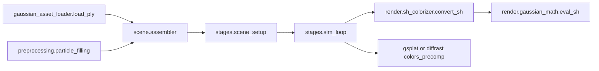

# SH 系数解耦重构计划

## 目标
- 让 SH 相关逻辑局部复杂度可控、边界清晰、跨模块契约单一且可测试。
- 把“坐标系约定 + 视线方向变换 + SH 求值”从隐式跨文件约定改为显式接口。
- 在允许破坏兼容的前提下，移除历史兼容负担与误导性参数。

## 当前问题落点（8 个区域）
- 数据加载：[`/mnt/shared-storage-gpfs2/solution-gpfs02/liaoyuanjun/PhysGaussian/physics_sim/render/gaussian_asset_loader.py`](/mnt/shared-storage-gpfs2/solution-gpfs02/liaoyuanjun/PhysGaussian/physics_sim/render/gaussian_asset_loader.py)
- 场景参数承载：[`/mnt/shared-storage-gpfs2/solution-gpfs02/liaoyuanjun/PhysGaussian/physics_sim/scene/objects.py`](/mnt/shared-storage-gpfs2/solution-gpfs02/liaoyuanjun/PhysGaussian/physics_sim/scene/objects.py)、[`/mnt/shared-storage-gpfs2/solution-gpfs02/liaoyuanjun/PhysGaussian/physics_sim/stages/scene_setup.py`](/mnt/shared-storage-gpfs2/solution-gpfs02/liaoyuanjun/PhysGaussian/physics_sim/stages/scene_setup.py)
- 场景组装：[`/mnt/shared-storage-gpfs2/solution-gpfs02/liaoyuanjun/PhysGaussian/physics_sim/scene/assembler.py`](/mnt/shared-storage-gpfs2/solution-gpfs02/liaoyuanjun/PhysGaussian/physics_sim/scene/assembler.py)
- 仿真循环：[`/mnt/shared-storage-gpfs2/solution-gpfs02/liaoyuanjun/PhysGaussian/physics_sim/stages/sim_loop.py`](/mnt/shared-storage-gpfs2/solution-gpfs02/liaoyuanjun/PhysGaussian/physics_sim/stages/sim_loop.py)
- SH 求值与着色：[`/mnt/shared-storage-gpfs2/solution-gpfs02/liaoyuanjun/PhysGaussian/physics_sim/render/gaussian_math.py`](/mnt/shared-storage-gpfs2/solution-gpfs02/liaoyuanjun/PhysGaussian/physics_sim/render/gaussian_math.py)、[`/mnt/shared-storage-gpfs2/solution-gpfs02/liaoyuanjun/PhysGaussian/physics_sim/render/sh_colorizer.py`](/mnt/shared-storage-gpfs2/solution-gpfs02/liaoyuanjun/PhysGaussian/physics_sim/render/sh_colorizer.py)
- 渲染后端消费：[`/mnt/shared-storage-gpfs2/solution-gpfs02/liaoyuanjun/PhysGaussian/physics_sim/render/rasterizers/gsplat.py`](/mnt/shared-storage-gpfs2/solution-gpfs02/liaoyuanjun/PhysGaussian/physics_sim/render/rasterizers/gsplat.py)、[`/mnt/shared-storage-gpfs2/solution-gpfs02/liaoyuanjun/PhysGaussian/physics_sim/render/rasterizers/diffrast.py`](/mnt/shared-storage-gpfs2/solution-gpfs02/liaoyuanjun/PhysGaussian/physics_sim/render/rasterizers/diffrast.py)
- 预处理工具：[`/mnt/shared-storage-gpfs2/solution-gpfs02/liaoyuanjun/PhysGaussian/physics_sim/preprocessing/particle_filling.py`](/mnt/shared-storage-gpfs2/solution-gpfs02/liaoyuanjun/PhysGaussian/physics_sim/preprocessing/particle_filling.py)
- 配置入口：[`/mnt/shared-storage-gpfs2/solution-gpfs02/liaoyuanjun/PhysGaussian/pipeline.py`](/mnt/shared-storage-gpfs2/solution-gpfs02/liaoyuanjun/PhysGaussian/pipeline.py)、[`/mnt/shared-storage-gpfs2/solution-gpfs02/liaoyuanjun/PhysGaussian/physics_sim/pipeline_orchestrator.py`](/mnt/shared-storage-gpfs2/solution-gpfs02/liaoyuanjun/PhysGaussian/physics_sim/pipeline_orchestrator.py)

## 分阶段实施

### Phase 1：先立契约与测试（不做大重排）
- 新增 SH 契约文档，统一以下定义：
  - `shs` 统一形状与通道语义（`(N, C, 3)`）
  - 坐标系约定（系数空间、视线方向空间）
  - `view_dir` 计算顺序（旋转、对齐、归一化）
- 为以下关键点补测试：
  - `f_dc/f_rest` 计数与 reshape 规则
  - `eval_sh` 每阶输出对照
  - `convert_sh` 的方向变换与数值稳定性
  - `particle_filling` 进出形状一致性
- 输出基线回归样例（小规模固定输入输出），作为后续破坏性重构安全网。

### Phase 2：模块解耦与复杂度下沉
- 拆分 [`gaussian_math.py`](/mnt/shared-storage-gpfs2/solution-gpfs02/liaoyuanjun/PhysGaussian/physics_sim/render/gaussian_math.py)：
  - `sh_eval.py`：仅保留 SH 常数与求值（纯张量逻辑）
  - `gaussian_geometry.py`：旋转矩阵/协方差构造
- 在 [`sh_colorizer.py`](/mnt/shared-storage-gpfs2/solution-gpfs02/liaoyuanjun/PhysGaussian/physics_sim/render/sh_colorizer.py) 提取独立的 `compute_view_dirs_*` 纯函数，避免在 `convert_sh` 里混杂切片、旋转与坐标系变换细节。
- 消除 `device="cuda"` 硬编码，改为从输入张量继承 device。

### Phase 3：直接清理历史语义（允许破坏兼容）
- 重设 `convert_sh` 接口为“显式输入视线方向”或“显式传入动态与静态分组”，不再依赖“只旋转前缀 n 个粒子”这种隐式约定。
- 清理渲染后端中误导性 SH 参数路径：
  - 明确后端只消费 `colors_precomp`
  - 移除或收敛与当前路径无实际作用的 `sh_degree` 传递
- 统一 `particle_filling` 与主链路的 SH 形状表达，删除无效中间初始化逻辑。

### Phase 4：入口收敛与边界稳定
- 在 orchestrator 与 pipeline 层收敛 SH 配置注入路径，保留一个稳定外部入口。
- 对外暴露稳定接口（加载、着色、预处理入口），并把内部实现细节隔离到 render/preprocessing 子模块。

## 验收标准
- SH 主链路中不再出现隐式“前缀切片语义”耦合。
- SH 相关核心模块单测覆盖到加载、求值、方向变换、预处理四类行为。
- `render` 子模块依赖方向清晰：求值、几何、后端消费分层明确。
- 变更后能通过现有渲染流程并在基线样例上保持可解释的一致性（误差在预设阈值内）。

## 风险与缓解
- 视觉结果偏移风险：通过固定相机与固定粒子快照做帧差回归。
- 破坏兼容导致调用方失效：在迁移窗口提供一次性迁移脚本或明确升级说明。
- 预处理路径和主渲染路径形状约定不一致：通过共享 shape 校验工具函数与契约测试避免回退。