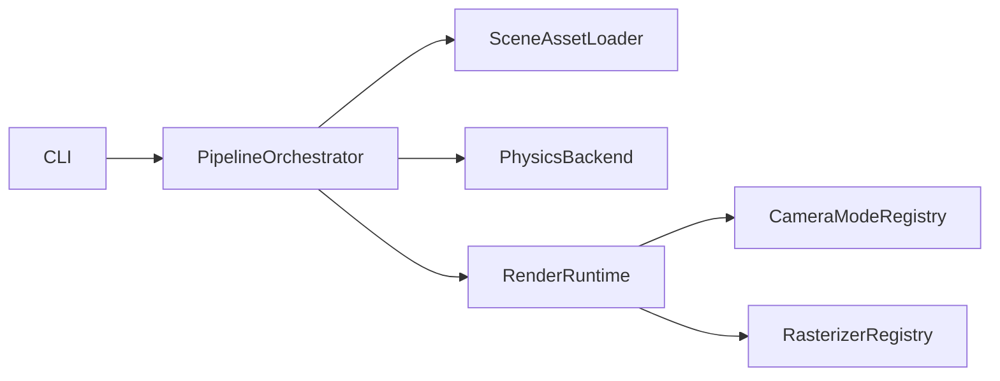

# 去门面化收尾计划

## 目标
- 完成 `gs_renderer` 兼容壳下线，消除长期门面回流风险。
- 清理旧 `physics_sim/renderer/*` 路径残留，统一到 `physics_sim/render/*`。
- 给出可复现的验证结论（代码层 + 运行层），形成可交付收口。

## 当前基线（已完成）
- 入口已收敛到 orchestrator：[`/mnt/shared-storage-gpfs2/solution-gpfs02/liaoyuanjun/PhysGaussian/pipeline.py`](/mnt/shared-storage-gpfs2/solution-gpfs02/liaoyuanjun/PhysGaussian/pipeline.py)、[`/mnt/shared-storage-gpfs2/solution-gpfs02/liaoyuanjun/PhysGaussian/physics_sim/pipeline_orchestrator.py`](/mnt/shared-storage-gpfs2/solution-gpfs02/liaoyuanjun/PhysGaussian/physics_sim/pipeline_orchestrator.py)
- 新边界模块已建立：[`/mnt/shared-storage-gpfs2/solution-gpfs02/liaoyuanjun/PhysGaussian/physics_sim/render/interfaces.py`](/mnt/shared-storage-gpfs2/solution-gpfs02/liaoyuanjun/PhysGaussian/physics_sim/render/interfaces.py)
- 兼容壳仍存在：[`/mnt/shared-storage-gpfs2/solution-gpfs02/liaoyuanjun/PhysGaussian/physics_sim/renderer/gs_renderer.py`](/mnt/shared-storage-gpfs2/solution-gpfs02/liaoyuanjun/PhysGaussian/physics_sim/renderer/gs_renderer.py)

## 执行步骤

### 1) 删除兼容壳与旧导出（Phase 2.5 核心）
- 删除 [`/mnt/shared-storage-gpfs2/solution-gpfs02/liaoyuanjun/PhysGaussian/physics_sim/renderer/gs_renderer.py`](/mnt/shared-storage-gpfs2/solution-gpfs02/liaoyuanjun/PhysGaussian/physics_sim/renderer/gs_renderer.py)。
- 更新 [`/mnt/shared-storage-gpfs2/solution-gpfs02/liaoyuanjun/PhysGaussian/physics_sim/renderer/__init__.py`](/mnt/shared-storage-gpfs2/solution-gpfs02/liaoyuanjun/PhysGaussian/physics_sim/renderer/__init__.py) 移除 `GaussianRenderer` 导出，避免旧入口继续可见。
- 全仓扫描修正仍指向旧门面的 import（若存在）。

### 2) 统一 renderer 目录职责
- 评估并处理 [`/mnt/shared-storage-gpfs2/solution-gpfs02/liaoyuanjun/PhysGaussian/physics_sim/renderer/backend_gsplat.py`](/mnt/shared-storage-gpfs2/solution-gpfs02/liaoyuanjun/PhysGaussian/physics_sim/renderer/backend_gsplat.py)、[`/mnt/shared-storage-gpfs2/solution-gpfs02/liaoyuanjun/PhysGaussian/physics_sim/renderer/backend_diffrast.py`](/mnt/shared-storage-gpfs2/solution-gpfs02/liaoyuanjun/PhysGaussian/physics_sim/renderer/backend_diffrast.py)：
  - 若已无调用，删除；
  - 若暂需保留，改成只做薄别名并写清删除窗口。
- 保留工厂单一来源（建议继续用 [`/mnt/shared-storage-gpfs2/solution-gpfs02/liaoyuanjun/PhysGaussian/physics_sim/renderer/backend_base.py`](/mnt/shared-storage-gpfs2/solution-gpfs02/liaoyuanjun/PhysGaussian/physics_sim/renderer/backend_base.py)）但只指向新 `render/rasterizers` 实现。

### 3) 锁定“新增功能不回填核心”约束
- 在 [`/mnt/shared-storage-gpfs2/solution-gpfs02/liaoyuanjun/PhysGaussian/docs/architecture/pipeline-boundaries.md`](/mnt/shared-storage-gpfs2/solution-gpfs02/liaoyuanjun/PhysGaussian/docs/architecture/pipeline-boundaries.md) 增加硬规则：禁止新增对 `physics_sim/renderer/*`（除工厂）的依赖。
- 在 [`/mnt/shared-storage-gpfs2/solution-gpfs02/liaoyuanjun/PhysGaussian/tests/test_pipeline_boundaries.py`](/mnt/shared-storage-gpfs2/solution-gpfs02/liaoyuanjun/PhysGaussian/tests/test_pipeline_boundaries.py) 增加“禁旧入口”断言（例如禁止 `gs_renderer` 文件存在或禁止相关 import）。

### 4) 回归与运行验证
- 代码级：`compileall`、边界测试、静态扫描旧 import。
- 运行级：
  - `--no_render` 冒烟（验证不创建 render runtime，不触发 gsplat 路径）；
  - 渲染路径最小冒烟（至少一帧）验证注册链路正常。
- 若受环境（如 `libcupti.so.13`）阻断，记录为环境前置条件并补“可复现命令 + 期望输出”。

## 关键风险与应对
- 风险：删除兼容壳后外部脚本可能断裂。  
  应对：先全仓扫描，再给出迁移映射（旧 API -> 新入口）。
- 风险：运行验证受 CUDA/torch 动态库影响。  
  应对：将“代码正确性验证”和“环境可运行验证”分离报告，避免混淆。

## 完成判定
- 仓库中不再存在 `GaussianRenderer` 可用入口。
- 新增相机模式/后端仅需“新增模块 + registry 注册”，无需改 `pipeline.py` 与 `sim_loop.py` 主干。
- 边界测试通过，且文档中有明确迁移与扩展指引。

## 执行流（收尾后）

