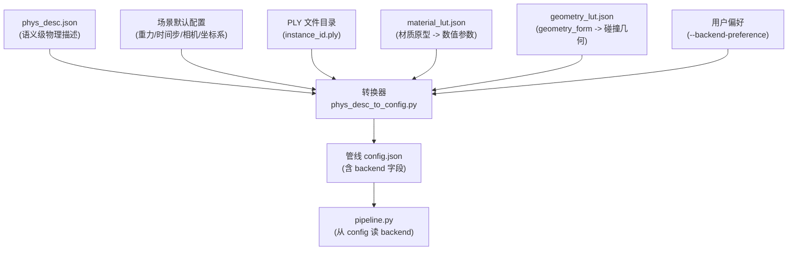

# 接入 phys_desc.json 到 PhysGaussian 管线

## 现状分析

**phys_desc.json 提供的信息（语义级）：**

- `behavior_template`: static / dynamic_rigid / dynamic_soft / out_of_range
- `geometry_form`: solid / hollow / thin_sheet / filamentary / stuffed
- `appearance_materials`: 带置信度的材质原型列表（如 rigid_plastic 0.74, metal 0.18）
- `physical_priors`: heaviness_bin / stiffness_bin / surface_friction_bin（离散档位 + 置信度）

**当前管线配置（[config/bench_manual_rigid_config.json](config/bench_manual_rigid_config.json)）需要的信息（数值级）：**

- 每个物体的 `mode`（simulate / collider_only / render_only）、`ply_path`、数值化的 `density`、`mu`、`E`、`nu`、`ke`/`kd` 等
- 碰撞体配置（plane fitting 参数、surface 类型、friction 值）
- 后端选择和求解器参数
- 场景级参数（重力、时间步、相机、坐标轴）

## 需要补齐的模块

### 设计原则

- **Backend 选择在转换器中完成**：因为 backend 与物理参数 override（如 `newton_rigid.solver.iterations`）是耦合的，转换器根据场景物体类型组成 + 用户偏好推断 backend，并将其连同对应的 override 参数一起写入 config JSON。
- **映射表均为外部可配置文件**：材质映射和几何体映射都用独立 JSON 文件，不硬编码到代码中，方便迭代调参。
- **Config JSON 新增 `backend` 字段**：pipeline.py 当 CLI 未指定 `--backend` 时，从 config 读取。

### 整体数据流




### 1. 材质参数映射表 (`physics_sim/config/material_lut.json`)

**纯 JSON 配置文件**，不含代码逻辑。转换器加载后在 Python 中做加权混合。

结构示意：

```json
{
  "prototypes": {
    "rigid_plastic": {"density": 1050, "E": 2e9,  "nu": 0.35, "mu": 0.4},
    "metal":         {"density": 7800, "E": 2e11, "nu": 0.30, "mu": 0.3},
    "wood":          {"density": 600,  "E": 1e10, "nu": 0.35, "mu": 0.5},
    "rubber":        {"density": 1100, "E": 1e7,  "nu": 0.48, "mu": 0.8},
    "organic_soft":  {"density": 950,  "E": 1e5,  "nu": 0.45, "mu": 0.5},
    "fabric":        {"density": 300,  "E": 1e6,  "nu": 0.30, "mu": 0.6},
    "foam":          {"density": 50,   "E": 5e4,  "nu": 0.30, "mu": 0.5},
    "brittle_mineral": {"density": 2500, "E": 5e10, "nu": 0.25, "mu": 0.6},
    "flexible_plastic": {"density": 950, "E": 5e8, "nu": 0.40, "mu": 0.45},
    "paper_fiber":   {"density": 700,  "E": 3e9,  "nu": 0.30, "mu": 0.5},
    "leather":       {"density": 860,  "E": 1e8,  "nu": 0.40, "mu": 0.55},
    "liquid":        {"density": 1000, "E": 0,    "nu": 0.49, "mu": 0.0},
    "granular":      {"density": 1500, "E": 1e6,  "nu": 0.30, "mu": 0.6},
    "unknown":       {"density": 500,  "E": 1e7,  "nu": 0.35, "mu": 0.4}
  },
  "bin_scales": {
    "heaviness_bin": {
      "very_light": 0.3, "light": 0.6, "medium": 1.0,
      "heavy": 2.0, "very_heavy": 5.0, "unknown": 1.0
    },
    "stiffness_bin": {
      "very_soft": 0.1, "soft": 0.3, "medium": 1.0,
      "stiff": 3.0, "very_stiff": 10.0, "unknown": 1.0
    },
    "surface_friction_bin": {
      "low": 0.5, "medium": 1.0, "high": 1.5, "unknown": 1.0
    }
  },
  "bin_targets": {
    "heaviness_bin": "density",
    "stiffness_bin": "E",
    "surface_friction_bin": "mu"
  }
}
```

**混合逻辑**（在转换器 Python 代码中实现）：

- 对 `appearance_materials` 中的多个候选，用 `score` 加权混合基础参数
- 用 `physical_priors` 中各 bin 的值作为缩放因子，调整对应参数
- bin 的 `confidence` 可用于插值（confidence 低时缩放因子向 1.0 靠拢）

### 2. 代理几何体映射表 (`physics_sim/config/geometry_lut.json`)

同样纯 JSON，将 `geometry_form` 映射为碰撞几何类型及关联参数：

```json
{
  "solid":       {"collision_geometry": "convex_hull", "use_sdf": true},
  "hollow":      {"collision_geometry": "alpha_shape", "use_sdf": true, "alpha": 0.05},
  "thin_sheet":  {"collision_geometry": "alpha_shape", "use_sdf": false, "alpha": 0.02},
  "stuffed":     {"collision_geometry": "convex_hull", "use_sdf": false},
  "filamentary": {"collision_geometry": "alpha_shape", "use_sdf": false, "alpha": 0.03},
  "uncertain":   {"collision_geometry": "convex_hull", "use_sdf": true}
}
```

### 3. 转换器模块 (`phys_desc_to_config.py`)

核心职责：

- 加载 `phys_desc.json` + 两个 LUT JSON
- 遍历每个物体，根据 `behavior_template` 确定 `mode`：
  - `static` -> `collider_only`
  - `dynamic_rigid` -> `simulate`
  - `dynamic_soft` -> `simulate`
  - `out_of_range` -> `render_only`
- 调用材质映射逻辑，输出 `density`/`mu`/`E`/`nu` 等数值参数
- 调用几何体映射，输出 `collision_geometry`/`use_sdf`/`alpha` 等
- 对 `static` 物体自动生成 collider 配置（见下节）
- **推断 backend**：
  - 分析场景中 dynamic 物体的类型组成
  - 结合 `--backend-preference` 参数（auto / newton_rigid / newton_mpm / newton_vbd）
  - auto 规则：全 rigid -> newton_rigid；全 soft -> newton_mpm；混合 -> newton_vbd
  - 将推断结果写入 config JSON 的 `"backend"` 字段
  - 同时生成对应 backend 的 override 参数小节
- 合并场景级默认参数
- 输出完整 config JSON

CLI 接口：

```bash
python phys_desc_to_config.py \
  --phys_desc phys_desc.json \
  --ply_dir /path/to/ply_files/ \
  --output config/auto_config.json \
  --backend-preference auto \
  --scene-defaults scene_defaults.json   # 可选
```

### 4. 碰撞体自动配置（Static 物体）

转换器内 `_auto_collider_config(instance_id, ply_dir, physical_priors)` 函数：

- 加载该物体的 PLY 点云
- SVD 分析点云分布的最小方差方向 -> 平面法向
- 如果法向接近竖直 -> floor 类型，`prefer_up` 无需特殊设置
- 如果法向接近水平 -> wall 类型，设置对应的 `prefer_up`
- 从 `surface_friction_bin` 映射摩擦系数
- 从 `stiffness_bin` 推断 surface 类型（very_stiff -> slip，stiff -> slip，medium 及以下 -> sticky）
- 输出完整的 `collider` 配置块

### 5. pipeline.py 的适配

**唯一必要改动**：当 `--backend` 为默认值（如 `"auto"` 或 `None`）时，从 config JSON 的 `"backend"` 字段读取 backend 名。

在 [pipeline.py](pipeline.py) 的参数解析之后、后端创建之前加入：

```python
if args.backend == "auto" and "backend" in config:
    args.backend = config["backend"]
```

[physics_sim/config/parser.py](physics_sim/config/parser.py) 的 `decode_param_json` 需要将顶层 `"backend"` 字段透传（当前会被忽略）。

### 6. 场景级默认参数

转换器提供合理默认值，用户可通过 `--scene-defaults` JSON 覆盖：

- `gravity`: `[0, 0, -9.8]`
- `substep_dt`: `1e-4`, `frame_dt`: `1e-2`, `frame_num`: `120`
- `axis_permutation`: `"xz-y"`（常见的 3DGS 场景坐标系）
- 相机：`orbit` 模式的默认参数
- `opacity_threshold`: `0.1`
- `n_grid`: `200`

### 7. 最终使用方式

```bash
# Step 1: phys_desc.json -> config.json（转换器内完成 backend 推断）
python phys_desc_to_config.py \
  --phys_desc phys_desc.json \
  --ply_dir scene_data/plys/ \
  --output config/auto_config.json \
  --backend-preference auto

# Step 2: pipeline 从 config 读 backend，无需手动指定
python pipeline.py \
  --ply_path scene_data/all.ply \
  --config config/auto_config.json \
  --output output/auto_scene \
  --camera_mode orbit --sh_degree 0 --compile_video
```

### 8. scope 之外（记录备忘）

- 刚柔耦合（PBD + MPM 同时运行）：当前管线单后端架构不支持
- restitution：Newton rigid backend 当前未接入
- 非平面碰撞体：static 物体用 mesh collider 而非 plane
- 物体间约束（关节/铰链）：phys_desc.json 未描述

