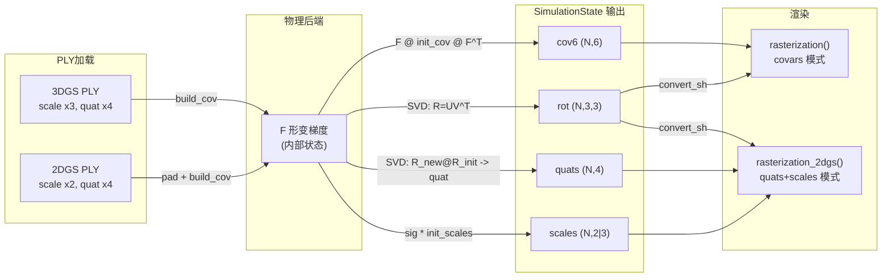

# 支持 2DGS PLY：零冗余转换的完整方案

## 目标

让 `pipeline.py` 能同时处理 3DGS（3 scale）和 2DGS（2 scale）PLY，在物理后端输出到渲染后端的路径上不做无谓的格式来回转换。

## 数据流对比




核心思路：**3DGS 路径只用 cov6，2DGS 路径只用 quats+scales，两条路径都不做反向转换**。物理后端在已有的 SVD 里顺带输出 quats+scales，边际开销极低。

## 分层修改

### 第 1 层：PLY 加载（自动检测格式）

修改 [physics_sim/renderer/gs_renderer.py](physics_sim/renderer/gs_renderer.py) 的 `load_ply()`。

当前代码动态扫描 `scale`_* 属性名（第 311-317 行），已经能拿到 2 或 3 个 scale。需要改的是：

- 返回的 dict 增加 `gs_type`（`"3dgs"` / `"2dgs"`）、`scales`、`quats` 字段
- 2DGS 时，给第三个 scale 填极小值（`log(1e-7)` 即 `exp` 后约 `1e-7`），然后照常算 `cov3D_precomp`（物理路径用）
- `build_covariance()` 本身不改，只确保输入 `scaling` 始终是 `(N, 3)`

```python
num_scales = len(scale_names)
gs_type = "2dgs" if num_scales == 2 else "3dgs"

if num_scales == 2:
    # Pad third scale (log-space, will go through exp)
    scales = np.concatenate([scales, np.full((N, 1), -16.0)], axis=1)

# ... rest unchanged ...

return {
    "pos": pos,
    "cov3D_precomp": cov3D,
    "opacity": opacity,
    "shs": shs,
    "screen_points": screen_points,
    "gs_type": gs_type,
    "quats": rotation_quat,     # (N, 4) 原始四元数
    "scales": scaling_raw,       # (N, 2) or (N, 3) exp 后的原始 scale
}
```

### 第 2 层：SimulationState 扩展

修改 [physics_sim/backend/base.py](physics_sim/backend/base.py)。

```python
@dataclass
class SimulationState:
    positions: torch.Tensor         # (N, 3)
    covariances: torch.Tensor       # (N, 6) — 3DGS 渲染用
    rotations: torch.Tensor         # (N, 3, 3) — SH 旋转用
    velocities: Optional[torch.Tensor] = None
    quats: Optional[torch.Tensor] = None    # (N, 4) — 2DGS 渲染用
    scales: Optional[torch.Tensor] = None   # (N, 2|3) — 2DGS 渲染用
```

新字段是 Optional，**所有现有后端无需修改即可继续工作**（默认 None）。

### 第 3 层：物理后端输出 quats+scales（按需）

仅当 pipeline 告知后端 `gs_type="2dgs"` 时，才额外输出 quats+scales。

#### 3a. 刚体后端（newton_rigid / newton_vbd）— 零成本

[newton_rigid/solver.py](physics_sim/backend/newton_rigid/solver.py) 第 554 行已经有 `body_quat`，第 561 行有 `init_cov`。刚体 scale 不变，旋转就是 body 四元数复合初始四元数：

```python
# 已有: body_quat (xyzw), R = _quat_to_rotmat(body_quat)
# 新增: 用 body_quat compose init_quats[idx] 得到 new_quats
# scales 不变，直接返回 init_scales[idx]
```

需要在 `initialize()` 时额外存储每个 body 的 `init_quats` 和 `init_scales`。

#### 3b. MPM 后端（newton_mpm / warp_mpm）— 复用 SVD

两个 MPM 后端的 `compute_R_from_F` kernel 已经做了 SVD：

```python
wp.svd3(F, U, sig, V)   # sig 是奇异值，当前被丢弃
R = U * wp.transpose(V)
```

扩展这个 kernel，额外输出：

- `new_R_full = R @ R_init` → 转四元数存入 `out_quats`
- `new_scales = sig * init_scales`（对角拉伸应用到初始 scale）→ 存入 `out_scales`

具体来说，增加一个新 kernel `compute_R_quats_scales_from_F`，在同一次 SVD 里输出三样东西（R、quats、scales）。当 `gs_type="3dgs"` 时调原 kernel（不影响性能），`"2dgs"` 时调新 kernel。

**关于 `new_scales = sig * init_scales` 的正确性**：

F 的极分解 `F = R_polar @ S_stretch`，其中 `S_stretch = V @ diag(sig) @ V^T`。对于 2DGS，初始协方差是 `Σ_init = R_init @ diag(s^2) @ R_init^T`，变形后 `Σ_new = F @ Σ_init @ F^T`。严格来说，新 scales 不等于简单的 `sig * init_scales`——需要对 `S_stretch` 在初始旋转坐标系下投影。但对于小形变（大多数物理场景），这是良好的近似。完全精确的做法是在 kernel 里对 `F @ R_init @ diag(s)` 做 SVD 得到精确的 new_R 和 new_s，但多一次 SVD 开销更大。

可以先用近似方案，后续对比验证视觉差异。

### 第 4 层：渲染接口扩展

修改 [physics_sim/renderer/backend_base.py](physics_sim/renderer/backend_base.py)：

```python
class RasterBackend(ABC):
    @abstractmethod
    def render(
        self,
        camera: SimpleCamera,
        means: torch.Tensor,
        colors: torch.Tensor,
        opacities: torch.Tensor,
        bg_color: torch.Tensor | None = None,
        *,
        cov6: torch.Tensor | None = None,
        quats: torch.Tensor | None = None,
        scales: torch.Tensor | None = None,
    ) -> tuple[torch.Tensor, dict]:
```

将 `cov6` 从位置参数改为关键字参数，与 `quats`/`scales` 并列。调用方明确传其中一组。

修改 [physics_sim/renderer/backend_gsplat.py](physics_sim/renderer/backend_gsplat.py)：

```python
class GsplatBackend(RasterBackend):
    def render(self, camera, means, colors, opacities, bg_color=None,
               *, cov6=None, quats=None, scales=None):
        if quats is not None and scales is not None:
            return self._render_2dgs(camera, means, quats, scales,
                                     colors, opacities, bg_color)
        return self._render_3dgs(camera, means, cov6, colors, opacities, bg_color)
```

- `_render_3dgs`：现有逻辑（`covars` 模式）
- `_render_2dgs`：调 `gsplat.rendering.rasterization_2dgs(means, quats, scales, ...)`

修改 [physics_sim/renderer/backend_diffrast.py](physics_sim/renderer/backend_diffrast.py)：

diffrast 不支持原生 2DGS。收到 `quats+scales` 时，fallback 到用 `cov6`（调用方需同时传 `cov6`），或直接报错。

修改 [physics_sim/renderer/gs_renderer.py](physics_sim/renderer/gs_renderer.py) 的 `render()` 委托方法，透传新参数。

### 第 5 层：Pipeline 串联

修改 [pipeline.py](pipeline.py)：

- 加载 PLY 后记录 `gs_type`，保存 `init_quats` 和 `init_scales`
- 将 `gs_type`（及 `init_quats`/`init_scales`）传给物理后端的 `initialize()` —— 通过 `**init_kwargs` 即可
- 帧循环中根据 `gs_type` 决定传哪组参数给 `renderer.render()`：

```python
if gs_type == "2dgs":
    rendering, _meta = renderer.render(
        camera=camera, means=pos, colors=colors_precomp,
        opacities=cur_opacity, bg_color=bg_color,
        quats=state.quats[:gs_num], scales=state.scales[:gs_num],
    )
else:
    rendering, _meta = renderer.render(
        camera=camera, means=pos, colors=colors_precomp,
        opacities=cur_opacity, bg_color=bg_color,
        cov6=cov3D,
    )
```

## 改动影响范围


| 文件                        | 改动类型          | 3DGS 是否受影响           |
| ------------------------- | ------------- | -------------------- |
| `backend/base.py`         | 加 Optional 字段 | 否（默认 None）           |
| `gs_renderer.py` load_ply | 返回值多几个字段      | 否（向后兼容）              |
| `gs_renderer.py` render   | 签名加 kwargs    | 否（已有代码传 cov6 仍 work） |
| `backend_base.py`         | 签名加 kwargs    | 需小改现有后端签名            |
| `backend_gsplat.py`       | 加 2dgs 分支     | 3dgs 分支不变            |
| `backend_diffrast.py`     | 签名适配          | 逻辑不变                 |
| `pipeline.py`             | 加 gs_type 分支  | 3dgs 走原路径            |
| MPM kernels               | 新增 kernel     | 3dgs 不调新 kernel      |
| rigid backends            | 额外输出 quats    | 可选，3dgs 跳过           |


