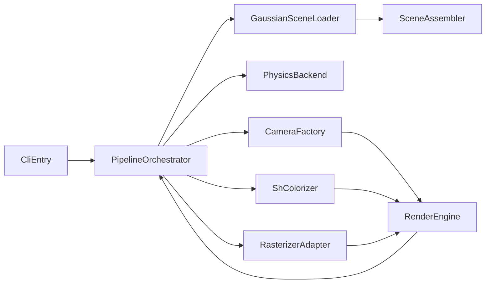

# 流水线职责边界重构计划

## 目标
- 核心流程稳定：新增功能优先“新增模块 + 注册”，而不是修改主流程。
- 职责单一：数据加载、场景组装、物理模拟、相机构建、SH 计算、栅格化分别归位。
- 迁移可控：每一阶段都可独立合并并回滚，避免一次性大改。
- 去门面化：`gs_renderer` 不再作为长期统一入口。

## 当前主要耦合点（需优先拆）
- [`/mnt/shared-storage-gpfs2/solution-gpfs02/liaoyuanjun/PhysGaussian/pipeline.py`](/mnt/shared-storage-gpfs2/solution-gpfs02/liaoyuanjun/PhysGaussian/pipeline.py)：入口同时承担参数解析、对象装配、流程分发，且 `--no_render` 仍创建 renderer。
- [`/mnt/shared-storage-gpfs2/solution-gpfs02/liaoyuanjun/PhysGaussian/physics_sim/renderer/gs_renderer.py`](/mnt/shared-storage-gpfs2/solution-gpfs02/liaoyuanjun/PhysGaussian/physics_sim/renderer/gs_renderer.py)：一个类同时负责 PLY 读取、相机、SH、栅格化后端，职责过重。
- [`/mnt/shared-storage-gpfs2/solution-gpfs02/liaoyuanjun/PhysGaussian/physics_sim/stages/scene_setup.py`](/mnt/shared-storage-gpfs2/solution-gpfs02/liaoyuanjun/PhysGaussian/physics_sim/stages/scene_setup.py) 与 [`/mnt/shared-storage-gpfs2/solution-gpfs02/liaoyuanjun/PhysGaussian/physics_sim/scene/assembler.py`](/mnt/shared-storage-gpfs2/solution-gpfs02/liaoyuanjun/PhysGaussian/physics_sim/scene/assembler.py)：场景组装实际只需 `load_ply`，却依赖完整 renderer。

## 目标架构（稳定边界）

## 分阶段实施

### Phase 1：先立接口，再挪实现（低风险）
- 在 `physics_sim` 下新增协议层（`typing.Protocol` 或 ABC）：
  - `SceneAssetLoader`：仅 `load_ply(path) -> GaussianAsset`
  - `CameraBuilder`：仅相机构建接口
  - `ColorComputer`：仅 SH->RGB
  - `Rasterizer`：仅栅格化
- `setup_scene/assemble_scene` 改为依赖 `SceneAssetLoader` 协议，不再依赖 `GaussianRenderer` 具体类。
- 引入“硬约束”并立即执行：新代码禁止新增对 `gs_renderer` 的 import；新增能力必须接到拆分模块。

### Phase 2：拆分 renderer（职责归位）
- 从 `gs_renderer.py` 迁出独立模块：
  - `physics_sim/render/gaussian_asset_loader.py`
  - `physics_sim/render/camera_factory.py`
  - `physics_sim/render/sh_colorizer.py`
  - `physics_sim/render/rasterizers/{gsplat,diffrast}.py`
- `GaussianRenderer` 不再承担组合逻辑，只保留“弃用兼容壳”：
  - 仅保留最小转发与 `DeprecationWarning`
  - 不允许新增功能或分支逻辑
  - 明确在后续里程碑删除
- 后端导入改懒加载（首次实际渲染再 import），彻底消除 `--no_render` 的渲染依赖。

### Phase 2.5：删除兼容壳（去歧义）
- 在核心调用点完成迁移后，删除 `gs_renderer` 兼容壳与旧路径引用。
- 全仓搜索确保仅保留新模块入口（loader/camera/colorizer/rasterizer）。
- 对外文档与示例全部改为新入口，防止“旧写法复活”。

### Phase 3：收敛 pipeline 为编排器（核心流程稳定）
- 将 [`/mnt/shared-storage-gpfs2/solution-gpfs02/liaoyuanjun/PhysGaussian/pipeline.py`](/mnt/shared-storage-gpfs2/solution-gpfs02/liaoyuanjun/PhysGaussian/pipeline.py) 收敛为“参数解析 + 组装 orchestrator + 分支执行”。
- 引入 `PipelineOrchestrator`（可在 `physics_sim/stages` 或 `physics_sim/pipeline`）：
  - `prepare_scene()`
  - `run_headless()`
  - `run_rendering()`
- 规则：新增功能默认通过“注入新组件/策略”实现，非必要不改 orchestrator 主干。

### Phase 4：插件化扩展点（新增功能不改核心）
- 引入轻量注册表：
  - `AssetLoaderRegistry`（未来支持非 PLY 源）
  - `RasterizerRegistry`（新增 backend 只需注册）
  - `CameraModeRegistry`（新增 camera_mode 不改主循环）
- 将当前 `if/elif` 分发逐步改成“注册名 -> 实现类”映射。

### Phase 5：回归保护与交接文档（防反复修补）
- 增加最小契约测试（非端到端大测也可）：
  - `--no_render` 在无 gsplat 环境可跑通。
  - `setup_scene` 仅依赖 loader 协议。
  - 每个 rasterizer 适配器满足统一输入输出契约。
- 增加开发文档：
  - `docs/architecture/pipeline-boundaries.md`
  - `docs/howto/add-rasterizer.md`
  - `docs/howto/add-camera-mode.md`
- 在文档中固定“新增功能 checklist”，便于人和 AI 快速接手。

## 关键约束（保证“读起来顺、改起来稳”）
- 依赖方向固定：`stages/scene` 不能 import rasterizer；`physics backend` 不 import render 细节。
- `dataclass/typed model` 承担跨层数据契约，避免松散 dict 传播。
- 兼容层只允许短期存在，且必须有删除时间点；不得作为长期门面。
- 所有新增功能必须落在新模块，不得回填到 `gs_renderer`。

## 验收标准
- `--no_render` 完全不触发 `gsplat/diffrast` 导入。
- 新增一种相机模式或栅格后端时，不改 `pipeline.py` 主逻辑，仅新增模块 + 注册。
- `gs_renderer.py` 在迁移末期被删除（或仅保留单行导入别名并标记即将移除）。
- 新人或 AI 根据文档可在一次 PR 内完成“新增后端/模式”且无需返工核心流程。
