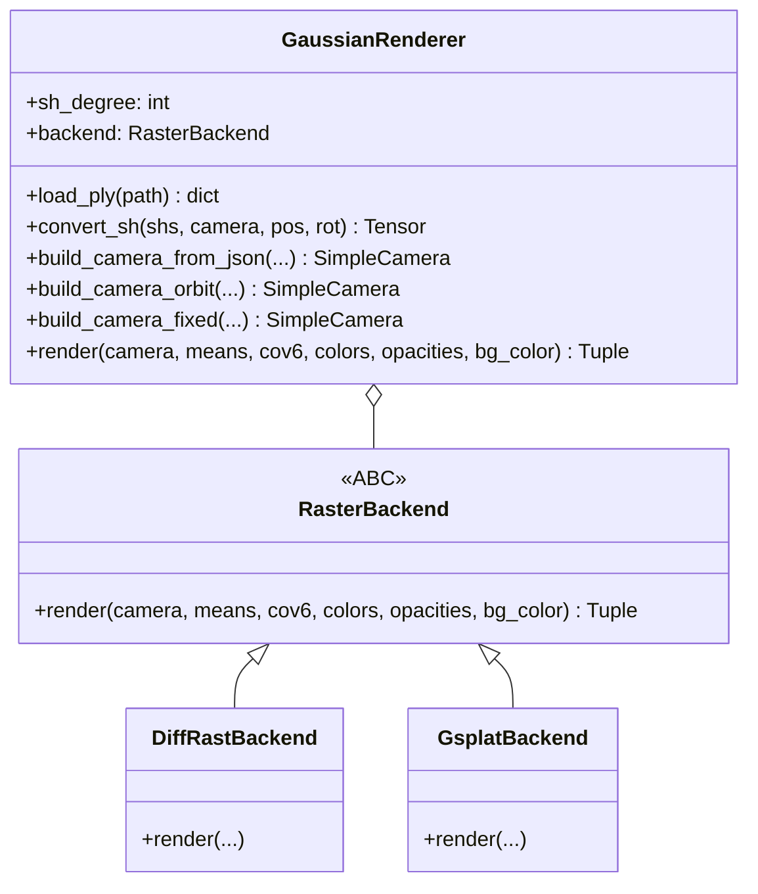

# 渲染层抽象重构 + gsplat 后端接入

## 设计思路

将当前耦合在 `GaussianRenderer` 里的光栅化逻辑抽象为一个 **渲染后端协议**，让 `diff_gaussian_rasterization` 和 `gsplat` 各自作为一个后端实现。`pipeline.py` 通过 CLI 参数选择后端，调用统一接口。




## 统一渲染接口

```python
class RasterBackend(ABC):
    """光栅化后端抽象基类。"""

    @abstractmethod
    def render(
        self,
        camera: SimpleCamera,
        means: torch.Tensor,      # (N, 3) 世界空间位置
        cov6: torch.Tensor,        # (N, 6) 上三角协方差
        colors: torch.Tensor,      # (N, 3) 预计算 RGB
        opacities: torch.Tensor,   # (N, 1) 透明度
        bg_color: torch.Tensor,    # (3,) 背景色
    ) -> tuple[torch.Tensor, dict]:
        """渲染一帧。
        Returns:
            rendered_image: (3, H, W) float32
            meta: 后端特定的元信息（如 radii 等）
        """
        ...
```

两个后端各自负责：

- **数据格式转换**（cov6->cov3x3、opacity squeeze 等）
- **相机参数适配**（viewmatrix/projmatrix vs viewmats/Ks）
- **输出格式归一化**（统一输出 `[3, H, W]`）

## 文件结构

```
physics_sim/renderer/
    __init__.py              # 导出 GaussianRenderer, create_raster_backend
    gs_renderer.py           # GaussianRenderer (PLY加载/SH/相机构建 + 委托render)
    backend_base.py          # RasterBackend ABC
    backend_diffrast.py      # DiffRastBackend (原有逻辑)
    backend_gsplat.py        # GsplatBackend (新增)
```

## 各文件详细修改

### 1. 新建 [physics_sim/renderer/backend_base.py](physics_sim/renderer/backend_base.py)

定义 `RasterBackend` 抽象基类，包含 `render()` 方法签名。同时定义工厂函数 `create_raster_backend(name, sh_degree)` 根据名称创建后端。

### 2. 新建 [physics_sim/renderer/backend_diffrast.py](physics_sim/renderer/backend_diffrast.py)

从当前 [gs_renderer.py](physics_sim/renderer/gs_renderer.py) 第 363-397 行的 `build_rasterizer()` 逻辑搬过来，封装为 `DiffRastBackend.render()`：

- 内部构建 `GaussianRasterizationSettings` + `GaussianRasterizer`
- 接收统一接口的参数，调用原光栅化器
- 返回 `(rendered_image [3,H,W], {"radii": radii})`
- 依赖 `diff_gaussian_rasterization`，延迟导入

### 3. 新建 [physics_sim/renderer/backend_gsplat.py](physics_sim/renderer/backend_gsplat.py)

实现 `GsplatBackend.render()`：

- 协方差转换：`cov6 (N,6)` -> `covars (N,3,3)` 对称矩阵
- 相机适配：从 `SimpleCamera` 提取 `viewmat` (row-major 4x4) 和 `K` (3x3 内参)
- opacity 形状：`(N,1)` -> `(N,)`
- 调用 `gsplat.rendering.rasterization(means, covars=..., colors=..., opacities=..., viewmats=..., Ks=..., ...)`
- 输出转换：`[1, H, W, 3]` -> `[3, H, W]`
- 返回 `(rendered_image, meta_dict)`

关键转换代码：

```python
def _cov6_to_mat3(cov6):
    """(N, 6) 上三角 [c00,c01,c02,c11,c12,c22] -> (N, 3, 3) 对称矩阵"""
    N = cov6.shape[0]
    mat = torch.zeros((N, 3, 3), device=cov6.device, dtype=cov6.dtype)
    mat[:, 0, 0] = cov6[:, 0]
    mat[:, 0, 1] = mat[:, 1, 0] = cov6[:, 1]
    mat[:, 0, 2] = mat[:, 2, 0] = cov6[:, 2]
    mat[:, 1, 1] = cov6[:, 3]
    mat[:, 1, 2] = mat[:, 2, 1] = cov6[:, 4]
    mat[:, 2, 2] = cov6[:, 5]
    return mat
```

相机参数提取 -- 在 `SimpleCamera` 中新增两个属性：

```python
# viewmat: row-major world-to-camera 4x4 (gsplat 期望)
self.viewmat = torch.tensor(getWorld2View2(R, T), dtype=torch.float32).cuda()

# K: 3x3 内参矩阵
fx = fov2focal(FoVx, width)
fy = fov2focal(FoVy, height)
self.K = torch.tensor([
    [fx, 0, width * 0.5],
    [0, fy, height * 0.5],
    [0,  0,  1],
], dtype=torch.float32).cuda()
```

### 4. 修改 [physics_sim/renderer/gs_renderer.py](physics_sim/renderer/gs_renderer.py)

- **SimpleCamera**: 添加 `viewmat` 和 `K` 属性（如上）
- **GaussianRenderer.init**: 接收 `raster_backend` 参数，默认 `"gsplat"`
- **删除** `build_rasterizer()` 方法
- **新增** `render()` 方法：委托给 `self.backend.render()`
- 保留 `load_ply()`、`convert_sh()`、所有 `build_camera_*()` 方法不变

```python
class GaussianRenderer:
    def __init__(self, sh_degree=3, raster_backend="gsplat"):
        self.sh_degree = sh_degree
        self.backend = create_raster_backend(raster_backend, sh_degree)

    def render(self, camera, means, cov6, colors, opacities, bg_color=None):
        return self.backend.render(camera, means, cov6, colors, opacities, bg_color)
```

### 5. 修改 [physics_sim/renderer/**init**.py](physics_sim/renderer/__init__.py)

```python
from physics_sim.renderer.gs_renderer import GaussianRenderer
from physics_sim.renderer.backend_base import RasterBackend, create_raster_backend
```

### 6. 修改 [pipeline.py](pipeline.py)

**CLI 参数** (约第 154 行后新增)：

```python
parser.add_argument(
    "--raster_backend", type=str, default="gsplat",
    choices=["gsplat", "diffrast"],
    help="Rasterization backend (default: gsplat)",
)
```

**渲染器初始化** (约第 314 行)：

```python
renderer = GaussianRenderer(sh_degree=args.sh_degree, raster_backend=args.raster_backend)
```

**帧循环** (约第 1138-1268 行)：

- 删除 `rasterize = renderer.build_rasterizer(camera, bg_color)` (第 1157 行)
- 替换第 1246-1257 行的光栅化调用块：

```python
# 旧:
rasterize = renderer.build_rasterizer(camera, bg_color)
# ...
colors_precomp = renderer.convert_sh(cur_shs, camera, pos, rot)
screen_points = torch.zeros(...)
rendering, radii = rasterize(means3D=pos, means2D=screen_points, ...)

# 新:
colors_precomp = renderer.convert_sh(cur_shs, camera, pos, rot)
rendering, meta = renderer.render(
    camera=camera, means=pos, cov6=cov3D,
    colors=colors_precomp, opacities=cur_opacity,
    bg_color=bg_color,
)
```

- `rendering` 已经是 `[3, H, W]`，后续 `permute(1,2,0)` 和 cv2 保存逻辑不变

### 7. 依赖

- `requirements.txt`：添加 `gsplat`
- `diff_gaussian_rasterization` 不删除（`--raster_backend diffrast` 时仍需要）
- `--no_render` 逻辑不变，两个后端都是延迟导入

## 不需要改动的部分

- `load_ply()` -- PLY 加载逻辑不变
- `convert_sh()` -- SH 评估逻辑不变（保持逐粒子旋转支持）
- 所有 `build_camera_*()` 方法 -- 相机构建逻辑不变
- 物理模拟、坐标变换、静态粒子拼接 -- 全部不变

