# 相机格式与坐标重构计划

## 目标与约束
- 彻底移除旧的 `camera_mode="json"` 隐式契约，不保留兼容代码。
- 配置是唯一真源：格式名、位姿约定、输入路径、坐标系来源都在配置中显式声明。
- 满足你给的质量要求：局部复杂度低、逻辑就近、抽象层次一致、依赖简单、模块边界清晰。

## 现状问题（已定位）
- 现有入口把 `json` 当读取方式而非行业格式，导致名字无法表达语义（见 [physics_sim/config/models.py](/mnt/shared-storage-gpfs2/solution-gpfs02/liaoyuanjun/PhysGaussian/physics_sim/config/models.py) 与 [physics_sim/render/registries.py](/mnt/shared-storage-gpfs2/solution-gpfs02/liaoyuanjun/PhysGaussian/physics_sim/render/registries.py)）。
- 读取契约完全隐式（list + `rotation/position/fx/fy`），缺少 `format/convention/world_frame` 显式字段（见 [physics_sim/render/camera.py](/mnt/shared-storage-gpfs2/solution-gpfs02/liaoyuanjun/PhysGaussian/physics_sim/render/camera.py) 与 [physics_sim/render/camera_math.py](/mnt/shared-storage-gpfs2/solution-gpfs02/liaoyuanjun/PhysGaussian/physics_sim/render/camera_math.py)）。
- 路径解析在 `setup_camera` 与 `run_with_rendering` 之间不一致，可能造成读取路径语义漂移（见 [physics_sim/stages/camera_setup.py](/mnt/shared-storage-gpfs2/solution-gpfs02/liaoyuanjun/PhysGaussian/physics_sim/stages/camera_setup.py) 与 [physics_sim/stages/sim_loop.py](/mnt/shared-storage-gpfs2/solution-gpfs02/liaoyuanjun/PhysGaussian/physics_sim/stages/sim_loop.py)）。

## 新配置契约（一次到位，替换旧接口）
- 在 [physics_sim/config/models.py](/mnt/shared-storage-gpfs2/solution-gpfs02/liaoyuanjun/PhysGaussian/physics_sim/config/models.py) 中定义新字段并移除旧字段：
  - `camera_mode`: `orbit | fixed | external`
  - `camera_format`: `colmap | blender | nerfstudio | physgaussian | opencv | opengl`（`external` 必填）
  - `camera_path`: 外部相机输入路径（替代 `cameras_json`）
  - `camera_pose_convention`: `opencv_w2c | opengl_c2w`（显式声明；`opencv/opengl` 既可作为格式名也可作为约定名）
  - `camera_world_frame`: `source | internal`（声明输入位姿在哪个世界坐标系）
  - `camera_index`: 非负整数（替代旧 `default_camera_index` 及其 `<0` 特殊分支）
- 删除旧参数语义：`camera_mode="json"`、`default_camera_index<0` 的“用 json 内参 + 轨道外参重写”行为。

## 处理链路重排（低耦合实现）
- 在 [physics_sim/stages/camera_setup.py](/mnt/shared-storage-gpfs2/solution-gpfs02/liaoyuanjun/PhysGaussian/physics_sim/stages/camera_setup.py) 里一次性解析并固化 `camera_path`（相对 `config_dir`），写入 `CameraState.camera_params`，后续不再重复解析。
- 在 [physics_sim/render/registries.py](/mnt/shared-storage-gpfs2/solution-gpfs02/liaoyuanjun/PhysGaussian/physics_sim/render/registries.py) 中移除 `json` 注册，新增 `external` 注册；`orbit/fixed` 保持不变。
- 在 [physics_sim/stages/sim_loop.py](/mnt/shared-storage-gpfs2/solution-gpfs02/liaoyuanjun/PhysGaussian/physics_sim/stages/sim_loop.py) 去掉对 `cfg.camera.cameras_json` 的直接读取，只消费 `camera_state.camera_params`，确保单一数据来源。

```mermaid
flowchart LR
cfgCamera["CameraConfig"] --> setupCamera["setup_camera"]
setupCamera --> camParams["camera_params(absolute_path,format,convention,frame,index)"]
camParams --> resolver["resolve_camera_for_mode(external)"]
resolver --> cameraFactory["CameraFactory.build_camera_external"]
cameraFactory --> normalizePose["normalize_to_internal_w2c"]
normalizePose --> simpleCamera["SimpleCamera"]
```

## 相机读取与坐标规范化
- 在 [physics_sim/render/camera.py](/mnt/shared-storage-gpfs2/solution-gpfs02/liaoyuanjun/PhysGaussian/physics_sim/render/camera.py) 增加 `build_camera_external(...)`，并删除 `build_camera_from_json(...)`。
- 将“格式解析 + 约定转换”保持在同一抽象层：
  - 解析层：按 `camera_format` 读取为统一 `raw_camera`（`rotation, position, width, height, fx, fy`）。
  - 约定层：按 `camera_pose_convention` 把 `opencv_w2c` / `opengl_c2w` 统一到内部目标表示。
  - 世界坐标层：按 `camera_world_frame` 决定是否应用 `source_axes` 对齐到 internal Y-up。
- 对输入做硬校验并快速失败：矩阵形状、正交性、`det(R)`、索引越界、缺字段，报错信息带文件路径和字段名。

## 测试与文档
- 更新 [tests/test_pipeline_boundaries.py](/mnt/shared-storage-gpfs2/solution-gpfs02/liaoyuanjun/PhysGaussian/tests/test_pipeline_boundaries.py)：内置相机模式断言从 `json/orbit/fixed` 改为 `external/orbit/fixed`。
- 新增相机契约测试（建议新文件 `tests/test_camera_external_contract.py`）：
  - 配置校验：`external` 缺关键字段时报错。
  - 解析校验：`camera_format` 分发、`camera_index` 边界。
  - 坐标校验：`camera_world_frame=source` 时与 `SourceAxes` 对齐结果正确。
  - 约定校验：`opencv_w2c` 与 `opengl_c2w` 归一化后成像方向一致。
- 更新文档 [docs/howto/add-camera-mode.md](/mnt/shared-storage-gpfs2/solution-gpfs02/liaoyuanjun/PhysGaussian/docs/howto/add-camera-mode.md)：改为“新增相机格式/约定”的扩展说明，明确配置字段与最小示例。

## 验证清单
- 运行相机相关测试与边界测试，确保无旧 `json` 分支残留。
- 运行复杂度护栏（`physics_sim/complexity_guardrails.py --strict`），确保新增函数长度与嵌套深度不突破阈值。
- 用同一份 PLY 分别喂 `colmap/blender/nerfstudio` 样例相机，确认相机位置不再“突兀偏远”。